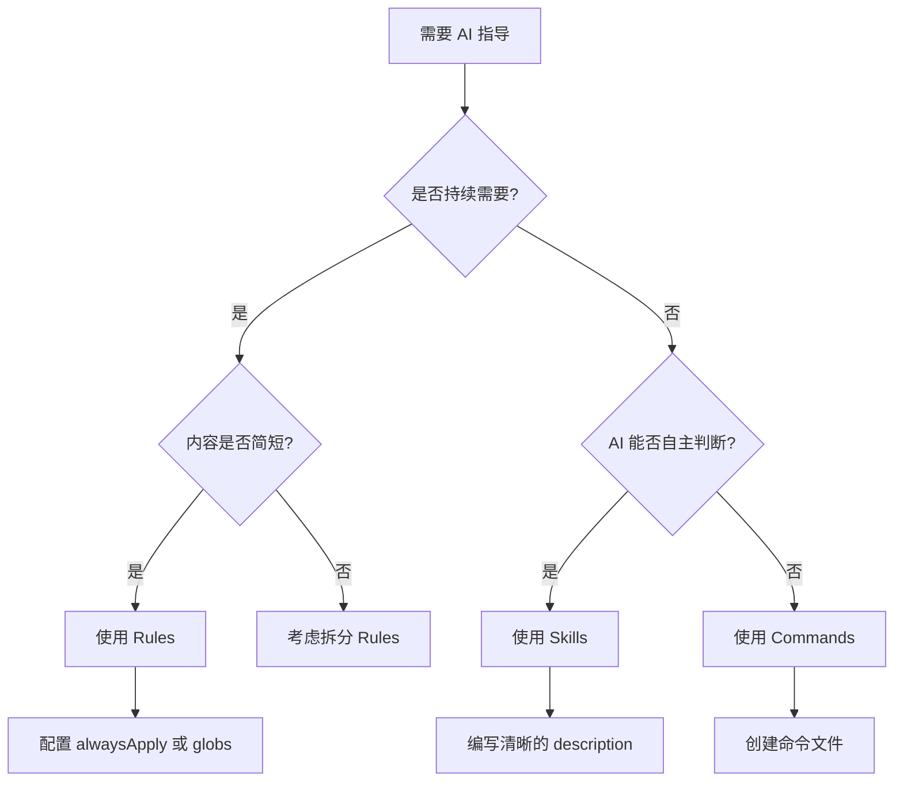

# Cursor 内置功能对比：Skills、Rules、Commands

## 📋 快速对比表

| 特性 | **Rules** | **Skills** | **Commands** |
|------|-----------|------------|--------------|
| **存储位置** | `.cursor/rules/*.mdc` | `.cursor/skills/` 或 `~/.cursor/skills/` | `.cursor/commands/` |
| **文件格式** | `.mdc` 文件（Markdown + YAML frontmatter） | 目录 + `SKILL.md` 文件 | 自定义提示词文件 |
| **触发方式** | 🔄 自动触发（基于配置） | 🤖 AI 自主调用 + 👤 手动调用 | 👤 仅手动调用 |
| **使用频率** | ⚡ 高频（持续加载） | 📊 中频（按需加载） | 📉 低频（按需加载） |
| **内容长度** | 📝 简短（建议 < 50 行） | 📄 中等（建议 < 500 行） | 📚 可较长（按需） |
| **适用场景** | 代码规范、风格指南、重复性要求 | 复杂工作流、专业任务、可复用技能 | 一次性任务、特定场景 |
| **上下文消耗** | ⚠️ 持续占用（需精简） | ✅ 按需占用 | ✅ 按需占用 |
| **共享性** | ✅ 项目级或全局 | ✅ 项目级或全局 | ✅ 项目级或全局 |

---

## 🔍 详细说明

### 1. Rules（规则）📏

**定义**：持久化的 AI 指导，用于强制执行代码风格和一致性规范。

**特点**：
- ✅ **自动应用**：根据配置自动加载到上下文中
- ✅ **持续生效**：在整个会话中持续生效
- ⚠️ **需精简**：因为持续占用上下文，内容必须简洁

**配置方式**：

```yaml
---
description: 文件大小指导原则
alwaysApply: true  # 始终应用
# 或
globs: **/*.ts      # 仅对特定文件类型应用
---
```

**适用场景**：
- ✅ 代码风格规范（如：使用单引号、缩进规则）
- ✅ 错误处理模式
- ✅ 命名约定
- ✅ 文件组织规范（如：你的 `file-size-limit.mdc`）

**示例**：
```markdown
---
description: TypeScript 编码规范
globs: **/*.ts
alwaysApply: false
---

# TypeScript 规范

- 使用 `interface` 而非 `type` 定义对象类型
- 函数必须显式声明返回类型
- 禁止使用 `any` 类型
```

---

### 2. Skills（技能）🛠️

**定义**：可复用的专业技能，教 AI 如何执行特定任务或工作流。

**特点**：
- 🤖 **AI 自主调用**：AI 可以根据描述自动判断是否需要使用
- 👤 **手动调用**：用户也可以手动触发
- 📄 **可包含脚本**：可以包含辅助脚本和详细文档

**目录结构**：
```
skill-name/
├── SKILL.md              # 必需：主要指令
├── reference.md          # 可选：详细文档
├── examples.md           # 可选：使用示例
└── scripts/              # 可选：工具脚本
    └── helper.py
```

**SKILL.md 格式**：
```markdown
---
name: code-review
description: Review code for quality, security, and maintainability. 
            Use when reviewing pull requests or code changes.
---

# Code Review

## Quick Start
[指令内容...]
```

**适用场景**：
- ✅ 代码审查工作流
- ✅ 数据库查询模式
- ✅ PDF 处理、Excel 分析等专业任务
- ✅ 复杂的多步骤工作流

**示例场景**：
- 📝 生成符合团队规范的 commit message
- 🔍 使用特定标准审查代码
- 📊 分析 Excel 表格并生成报告

---

### 3. Commands（命令）⚡

**定义**：手动触发的自定义提示词，仅在用户明确调用时加载。

**特点**：
- 👤 **仅手动调用**：必须由用户主动触发
- 📚 **可较长**：因为不持续占用上下文，可以包含更详细的内容
- 🎯 **一次性任务**：适合特定场景的一次性操作

**适用场景**：
- ✅ 特定的代码重构任务
- ✅ 一次性代码生成需求
- ✅ 特定格式的文档生成
- ✅ 临时性的复杂操作

**与 Skills 的区别**：
- **Skills**：AI 可以自主判断并调用
- **Commands**：必须用户手动触发

---

## 🎯 使用建议

### 选择指南



### 最佳实践

#### ✅ Rules 最佳实践
- **保持简短**：单条规则建议 < 50 行
- **聚焦单一关注点**：一条规则解决一个问题
- **提供具体示例**：包含正确和错误的代码示例
- **避免重复**：不要在不同规则中重复相同内容

#### ✅ Skills 最佳实践
- **清晰的描述**：description 要包含触发关键词
- **第三人称写作**：描述应该用第三人称（"Processes files" 而非 "I can process"）
- **包含 WHAT 和 WHEN**：说明做什么以及何时使用
- **渐进式披露**：核心内容在 SKILL.md，详细信息放在 reference.md

#### ✅ Commands 最佳实践
- **明确的使用场景**：清楚说明何时使用
- **详细的步骤**：可以包含完整的操作流程
- **可选的验证**：包含如何验证结果的步骤

---

## 📊 实际项目示例

### 你的项目中的 Rules

你当前有一个 Rule：`.cursor/rules/file-size-limit.mdc`

```yaml
---
description: 文件大小指导原则 - 单文件建议不超过300行，适度拆分
alwaysApply: true  # 始终应用
---
```

这个 Rule 会：
- ✅ 在所有会话中自动加载
- ✅ 持续指导 AI 关于文件拆分的规范
- ✅ 确保代码组织的一致性

### 何时考虑添加 Skills

如果你需要以下功能，可以考虑创建 Skills：

1. **代码审查技能**：教 AI 如何按照团队标准审查代码
2. **API 文档生成**：自动生成符合规范的 API 文档
3. **测试用例生成**：根据代码自动生成测试用例

### 何时考虑添加 Commands

如果你需要以下功能，可以考虑创建 Commands：

1. **特定重构任务**：如"将所有 class 组件转换为函数组件"
2. **一次性迁移**：如"将项目从 JavaScript 迁移到 TypeScript"
3. **特定格式生成**：如"生成符合特定模板的 README"

---

## 🔄 三者关系


**关系说明**：
- **Rules** 提供基础规范，为 Skills 和 Commands 提供上下文
- **Skills** 基于 Rules 的规范，执行更复杂的专业任务
- **Commands** 在特定场景下，可能需要遵循 Rules 和 Skills 的指导

---

## 📝 总结

| 维度 | Rules | Skills | Commands |
|------|-------|--------|----------|
| **核心价值** | 持续规范 | 专业技能 | 特定任务 |
| **使用频率** | 最高 | 中等 | 最低 |
| **内容长度** | 最短 | 中等 | 可最长 |
| **AI 自主性** | 自动应用 | 可自主调用 | 需手动触发 |
| **上下文成本** | 高（持续） | 中（按需） | 低（按需） |

**记住**：
- 🎯 **Rules** = 持续生效的规范（如你的文件大小限制）
- 🛠️ **Skills** = AI 可以自主使用的专业技能
- ⚡ **Commands** = 用户手动触发的特定任务

---

## 📚 参考资源

- [Cursor Rules 官方文档](https://docs.cursor.com)
- [创建 Skills 指南](~/.cursor/skills-cursor/create-skill/SKILL.md)
- [创建 Rules 指南](~/.cursor/skills-cursor/create-rule/SKILL.md)
