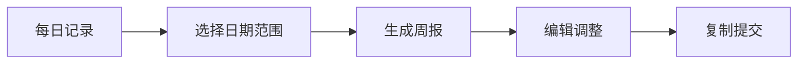
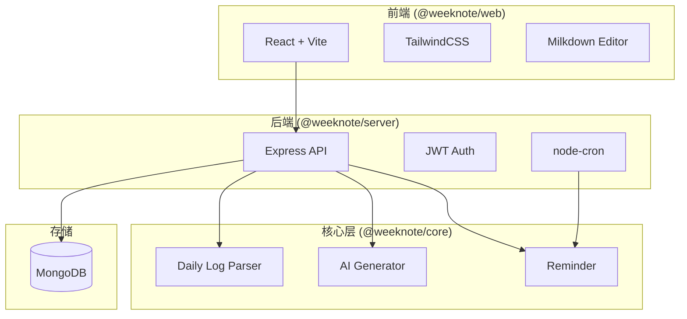

# WeekNote - AI 周报生成器 📝

将工程师的 Daily Log 自动整理为结构清晰、可提交的周报。

支持多用户、每日记录管理、Prompt 模板定制、智能提醒等功能。

## ✨ 功能特性

| 分类 | 功能 |
|------|------|
| 📅 **每日记录** | 日历视图、Milkdown 富文本编辑、自动保存 |
| 🤖 **AI 周报生成** | 一键生成、流式输出、多模型支持 |
| 📝 **Prompt 模板** | 自定义模板、模板广场、点赞收藏 |
| 🔔 **智能提醒** | 钉钉/微信推送、法定节假日识别、多时间点 |
| 👥 **多用户** | 注册登录、数据隔离、JWT 认证 |
| 🔥 **多平台模型** | 硅基流动(免费)、DeepSeek、OpenAI、豆包 |

## 📦 项目结构

```
weeknote/
├── packages/
│   ├── core/        # 核心逻辑（解析、生成、提醒）
│   ├── server/      # 后端 API（Express + MongoDB）
│   ├── web/         # 前端应用（React + Vite）
│   └── cli/         # 命令行工具（存档）
├── scripts/         # 启动脚本
└── docs/            # 产品文档
```

## 🚀 快速开始

### 环境要求

- Node.js 18.x（必须是 18，不支持更高版本）
- pnpm >= 9.15
- MongoDB 6.x+

### 安装与启动

```bash
# 1. 克隆项目
git clone <repo-url>
cd weeknote

# 2. 安装依赖
pnpm install

# 3. 配置环境变量
cat > .env << EOF
MONGODB_URI=mongodb://localhost:27017/weeknote
JWT_SECRET=your-secret-key-here
PORT=3000
EOF

# 4. 启动 MongoDB（如未运行）
brew services start mongodb-community
# 或使用 Docker
# docker run -d --name weeknote-mongo -p 27017:27017 mongo:latest

# 5. 启动开发环境
pnpm dev
```

### 访问地址

| 服务 | 地址 |
|------|------|
| 后端 API | http://localhost:3000 |
| 前端 Web | http://localhost:5173 |

### 使用启动脚本（推荐）

```bash
# 一键启动（自动检查环境、编译、启动）
./scripts/start-cloud.sh
```

## ⚙️ 环境变量

| 变量名 | 必填 | 说明 | 默认值 |
|--------|------|------|--------|
| `MONGODB_URI` | ✅ | MongoDB 连接地址 | - |
| `JWT_SECRET` | ✅ | JWT 签名密钥（生产环境必须修改） | - |
| `PORT` | ❌ | 后端服务端口 | 3000 |
| `JWT_ACCESS_EXPIRES` | ❌ | Access Token 过期时间（秒） | 604800 (7天) |
| `JWT_REFRESH_EXPIRES` | ❌ | Refresh Token 过期时间（秒） | 2592000 (30天) |

## 🌐 Web 功能介绍

### 页面导航

| 页面 | 路径 | 功能 |
|------|------|------|
| 首页 | `/` | 粘贴 Daily Log，一键生成周报 |
| 每日记录 | `/daily` | 日历选择日期，编辑每日工作记录 |
| 设置 - API Key | `/settings/api-key` | 配置各平台密钥，选择默认模型 |
| 设置 - Prompt | `/settings/prompt` | 管理自定义模板，浏览模板广场 |
| 设置 - 提醒 | `/settings/reminder` | 配置推送渠道，设置提醒时间 |

### 使用流程



1. 📅 **记录**：每天在「每日记录」页面记录工作内容
2. 📊 **生成**：周五在首页选择日期范围，点击生成
3. ✏️ **编辑**：对 AI 生成的周报进行微调
4. 📋 **复制**：一键复制，粘贴到周报系统

## 🤖 支持的模型

### 免费模型（硅基流动）

| 模型 ID | 名称 | 说明 |
|---------|------|------|
| `siliconflow/Qwen2.5-7B-Instruct` | 通义千问 2.5 (7B) | ⭐ 推荐 |
| `siliconflow/glm-4-9b-chat` | 智谱 GLM-4 (9B) | 中文优化 |

### 付费模型

| 平台 | 模型 ID | 说明 |
|------|---------|------|
| DeepSeek | `deepseek/deepseek-chat` | 性价比高 |
| 豆包 | `doubao/seed-1.6` | 需配置接入点 |
| OpenAI | `openai/gpt-4o` | GPT-4o |
| OpenAI | `openai/gpt-4o-mini` | 轻量版 |

> 💡 豆包（火山方舟）需要同时配置 API Key 和接入点 ID，在[火山方舟控制台](https://console.volcengine.com/ark/region:ark+cn-beijing/endpoint)创建。

## 🔔 提醒功能

### 支持的推送渠道

| 渠道 | 配置项 | 获取方式 |
|------|--------|----------|
| 钉钉机器人 | Webhook + 加签密钥 | 群设置 → 智能群助手 → 添加机器人 |
| Server酱 | SendKey | [sct.ftqq.com](https://sct.ftqq.com/) |

### 功能特性

- ⏰ 支持多时间点提醒（如上班、下班各一次）
- 📆 自动识别法定节假日和调休工作日
- 🔕 仅在工作日推送，节假日自动跳过
- 🧪 支持测试推送，验证配置是否正确

## 📝 Daily Log 格式

系统支持解析以下格式的 Daily Log：

```markdown
12-15 | 周一
Plan
- 计划任务 1
- 计划任务 2

Result
- 完成内容 1
- 完成内容 2

Issues
- 遇到的问题

Notes
- 备注信息

12-16 | 周二
Plan
...
```

## 📄 周报输出格式

生成的周报遵循以下结构：

```markdown
【本周工作总结】
- 项目A：
  - 完成了 xxx
  - 优化了 xxx

【本周输出成果（Deliverables）】
- ✓ 功能模块上线
- ✓ 文档更新

【问题 & 风险（Issues & Risks）】
- 问题 1：xxx
  - 影响：xxx
  - 需要：xxx

【下周工作计划】
- 计划 1：xxx
- 计划 2：xxx
```

## 🛠️ 开发指南

### 常用命令

```bash
# 启动开发环境（Server + Web 并行）
pnpm dev

# 或使用 Make
make dev

# 单独启动
pnpm dev:server    # 仅后端
pnpm dev:web       # 仅前端

# 构建
pnpm build         # 构建所有包
pnpm build:core    # 仅核心层
pnpm build:server  # 仅后端
pnpm build:web     # 仅前端

# 代码质量
pnpm lint          # ESLint 检查
pnpm lint:fix      # 自动修复
pnpm format        # Prettier 格式化

# 测试
pnpm test

# 重装依赖
make reinstall
```

### 项目架构



## 🔧 技术栈

| 层级 | 技术 |
|------|------|
| **语言** | TypeScript |
| **包管理** | pnpm Monorepo |
| **前端框架** | React 18 + Vite 5 |
| **样式** | TailwindCSS + Radix UI |
| **编辑器** | Milkdown（Markdown WYSIWYG） |
| **后端框架** | Express.js |
| **数据库** | MongoDB + Mongoose |
| **认证** | JWT + bcryptjs |
| **定时任务** | node-cron |
| **AI 接口** | OpenAI API 兼容 |

## 📚 相关文档

- [开发指南](./docs/开发指南.md) - 如何启动项目、VS Code Tasks 使用说明
- [快速开始](./docs/快速开始.md)
- [测试指南](./docs/测试指南.md)
- [技术方案文档](./docs/技术方案文档（V1）.md)
- [Server API 文档](./packages/server/README.md)

## 📄 License

MIT
