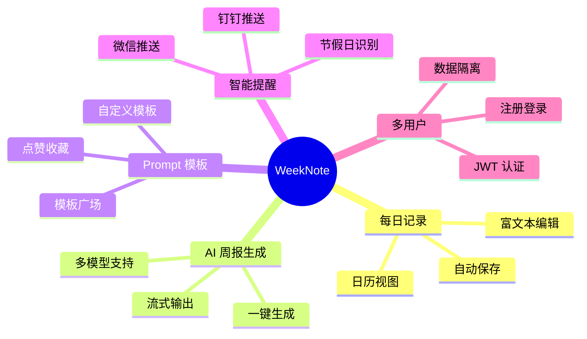
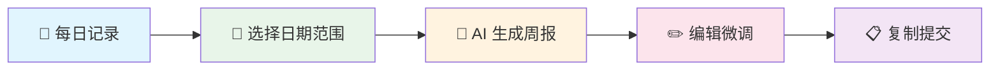
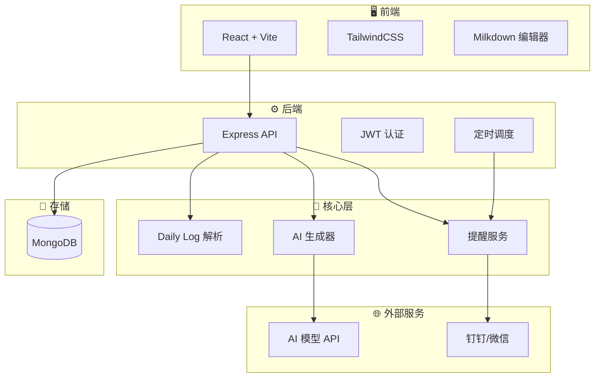

# WeekNote - AI 周报生成器 📝

> 🚀 让 AI 帮你把散乱的工作日志，变成一份专业、结构化的周报

---

## 🎯 产品定位

WeekNote 是一款面向**工程师个人**的 AI 周报整理工具。

它解决的核心问题是：**将一整周的 Daily Log，稳定转化为可直接提交的工程师周报。**

| 痛点 | WeekNote 的解决方案 |
|------|---------------------|
| 😩 Daily Log 零散，周五集中整理成本高 | 📅 日历视图管理，每天轻松记录 |
| 😵 需要手动复制 Prompt 到各种 AI 平台 | 🤖 内置 Prompt 模板，一键生成 |
| 😖 AI 输出不可控，经验无法沉淀 | ✏️ 可编辑结果，模板可自定义 |
| 😤 多平台切换，效率低下 | 🏠 一站式完成记录、生成、编辑 |

---

## ✨ 核心功能



### 📅 每日记录

- **日历视图**：直观选择日期，一目了然查看记录状态
- **Milkdown 富文本编辑器**：支持 Markdown 的所见即所得编辑体验
- **自动保存**：无需手动操作，内容自动同步云端

### 🤖 AI 周报生成

- **一键生成**：选择日期范围，点击按钮，周报即刻生成
- **流式输出**：实时显示 AI 生成内容，体验流畅
- **多模型支持**：免费/付费模型任选，灵活切换

### 📝 Prompt 模板

- **自定义模板**：根据个人需求调整 Prompt
- **模板广场**：浏览、使用、点赞其他用户分享的模板
- **一键复用**：优秀模板一键收藏使用

### 🔔 智能提醒

- **多渠道推送**：支持钉钉机器人、Server酱（微信）
- **节假日识别**：自动识别法定节假日和调休，仅工作日推送
- **多时间点**：可配置多个提醒时间（如早晚各一次）

---

## 🔥 支持的 AI 模型

| 类型 | 平台 | 模型 | 说明 |
|------|------|------|------|
| 🆓 免费 | 硅基流动 | Qwen2.5-7B-Instruct | ⭐ 推荐入门 |
| 🆓 免费 | 硅基流动 | GLM-4-9B-Chat | 中文优化 |
| 💰 付费 | DeepSeek | deepseek-chat | 性价比之王 |
| 💰 付费 | 豆包 | seed-1.6 | 火山方舟 |
| 💰 付费 | OpenAI | gpt-4o / gpt-4o-mini | 综合能力强 |

> 💡 **小贴士**：新用户推荐使用硅基流动的免费模型体验产品，后续可根据需求升级到付费模型。

---

## 📊 使用流程



| 步骤 | 操作 | 说明 |
|------|------|------|
| 1️⃣ | **每日记录** | 在「每日记录」页面记录工作内容（Plan/Result/Issues/Notes） |
| 2️⃣ | **选择范围** | 在首页选择本周的日期范围 |
| 3️⃣ | **生成周报** | 点击「生成周报」按钮，AI 实时输出 |
| 4️⃣ | **编辑调整** | 对生成结果进行个性化微调 |
| 5️⃣ | **复制提交** | 一键复制，粘贴到公司周报系统 |

---

## 📑 输入输出格式

### Daily Log 输入格式

```markdown
12-15 | 周一
Plan
- 计划任务 1
- 计划任务 2

Result
- 完成内容 1
- 完成内容 2

Issues
- 遇到的问题

Notes
- 备注信息
```

### 周报输出格式

```markdown
【本周工作总结】
- 项目A：
  - 完成了 xxx
  - 优化了 xxx

【本周输出成果（Deliverables）】
- ✓ 功能模块上线
- ✓ 文档更新

【问题 & 风险（Issues & Risks）】
- 问题 1：xxx
  - 影响：xxx
  - 需要：xxx

【下周工作计划】
- 计划 1：xxx
- 计划 2：xxx
```

---

## 🏗️ 技术架构



### 技术栈一览

| 层级 | 技术选型 |
|------|----------|
| 📦 包管理 | pnpm Monorepo |
| 🔤 语言 | TypeScript |
| 🖥️ 前端框架 | React 18 + Vite 5 |
| 🎨 样式方案 | TailwindCSS + Radix UI |
| ✍️ 编辑器 | Milkdown（Markdown WYSIWYG） |
| ⚙️ 后端框架 | Express.js |
| 💾 数据库 | MongoDB + Mongoose |
| 🔐 认证 | JWT + bcryptjs |
| ⏰ 定时任务 | node-cron |
| 🤖 AI 接口 | OpenAI API 兼容协议 |

---

## 📁 项目结构

```
weeknote/
├── packages/
│   ├── core/        # 🧠 核心逻辑（解析、生成、提醒）
│   ├── server/      # ⚙️ 后端 API（Express + MongoDB）
│   ├── web/         # 🖥️ 前端应用（React + Vite）
│   └── cli/         # ⌨️ 命令行工具（存档）
├── scripts/         # 📜 启动脚本
└── docs/            # 📚 产品文档
```

---

## 🚀 快速开始

### 环境要求

| 依赖 | 版本要求 |
|------|----------|
| Node.js | 18.x（必须，不支持更高版本） |
| pnpm | >= 9.15 |
| MongoDB | 6.x+ |

### 安装步骤

```bash
# 1. 克隆项目
git clone <repo-url>
cd weeknote

# 2. 安装依赖
pnpm install

# 3. 配置环境变量
cat > .env << EOF
MONGODB_URI=mongodb://localhost:27017/weeknote
JWT_SECRET=your-secret-key-here
PORT=3000
EOF

# 4. 启动 MongoDB
brew services start mongodb-community

# 5. 启动开发环境
pnpm dev
```

### 访问地址

| 服务 | 地址 |
|------|------|
| 🖥️ 前端 Web | http://localhost:5173 |
| ⚙️ 后端 API | http://localhost:3000 |

---

## 🔒 安全特性

| 特性 | 说明 |
|------|------|
| 🔐 密码加密 | 使用 bcryptjs 对用户密码进行加密存储 |
| 🎫 JWT 认证 | 双 Token 机制（Access + Refresh） |
| 👥 数据隔离 | 每个用户只能访问自己的数据 |
| 🔑 API Key 加密 | 用户的 AI 平台密钥加密存储 |

---

## 📈 产品优势

| 维度 | 优势 |
|------|------|
| 🎯 **专注度** | 专为工程师周报场景设计，不做大而全 |
| 🔓 **开放性** | 支持多个 AI 平台，不绑定特定供应商 |
| 🎨 **可定制** | Prompt 模板可自定义，适应不同团队风格 |
| 💡 **易用性** | 操作路径 ≤ 2 步：粘贴 → 生成 |
| 🆓 **低成本** | 免费模型可用，零成本起步 |

---

## 🗺️ 后续规划

| 方向 | 说明 | 状态 |
|------|------|------|
| 🐳 Docker 部署 | 容器化一键部署 | 规划中 |
| 📖 语雀集成 | 直接读取语雀文档 | 规划中 |
| 📊 数据分析 | 工作量统计、趋势分析 | 规划中 |
| 🔗 Notion 集成 | 同步 Notion 数据 | 规划中 |
| 📱 移动端适配 | 响应式布局优化 | 规划中 |

---

## 📄 License

MIT License

---

<div align="center">

**Made with ❤️ for Engineers**

让周报不再是负担，而是成果的展示

</div>
