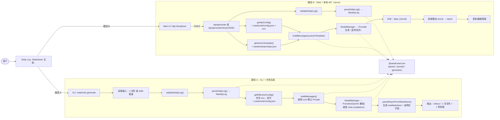

# WeekNote：一次完整周报生成流程（当前实现）

> 本文基于仓库当前代码（`packages/cli` + `packages/core` + `packages/web`）梳理一次“从 Daily Log 到周报 Markdown”的完整生成链路。

## 1. 入口与两种使用方式

当前一次完整的周报生成，主要有两条路径，**最终都会调用 `@weeknote/core` 完成解析与模型生成**：

- **路径 A：CLI 一次性生成**
  - 命令入口：`packages/cli/src/index.ts` → `weeknote generate`
  - 实现：`packages/cli/src/commands/generate.ts`
  - 适用场景：你已经有一份 Daily Log 文件（或管道输入），想快速产出周报。

- **路径 B：Web 可视化生成（本地 server + 浏览器 UI）**
  - 命令入口：`packages/cli/src/index.ts` → `weeknote serve`（别名 `weeknote web`）
  - 服务端：`packages/cli/src/server/index.ts`（Express + API + 静态资源）
  - 前端：`packages/web/src/pages/Home.tsx`（输入/生成/预览/复制）
  - 适用场景：你想边生成边预览（流式），并在浏览器中编辑/复制周报。

> 在仓库内开发/调试时，通常用 `pnpm cli ...` / `pnpm serve`；安装为全局 CLI 后可直接用 `weeknote ...`。

## 2. Mermaid：端到端流程图

## 3. Daily Log 输入：格式与解析规则

### 3.1 最小要求（能通过校验）

只要文本里出现至少一行符合下述格式的“日期行”，就能通过 `validateDailyLog()`：

- **日期行格式**：`M-D | 周X` 或 `MM-DD | 周X`
  - 例：`12-15 | 周一`

校验逻辑在：`packages/core/src/parser/index.ts` → `validateDailyLog()`

### 3.2 解析规则（parseDailyLog）

`parseDailyLog()` 会把原文拆成 `WeeklyLog`：

- 以日期行作为“每天”的分界
- 段落标题（不区分大小写）：`Plan` / `Result` / `Issues` / `Notes`
- 段落内容：
  - 以 `-` / `*` / `•` 开头的行，会去掉前缀作为条目
  - 其它非空行也会被直接当成条目写入（因此像 `[ ] xxx`、`● xxx` 也会被保留）

数据结构定义在：`packages/core/src/types/index.ts`

## 4. 配置：模型与 API Key 从哪里来

### 4.1 CLI（weeknote generate）读取配置

在 `packages/cli/src/commands/generate.ts` 中：

- 调用 `getEffectiveConfig()`（`packages/cli/src/config.ts`）
- 优先级：
  - **环境变量优先**：
    - `SILICONFLOW_API_KEY`
    - `DEEPSEEK_API_KEY`
    - `OPENAI_API_KEY`
  - 否则读取配置文件：`~/.weeknote/config.json`

> CLI 支持 `-m/--model` 临时覆盖模型（会覆盖 `config.primary.modelId`）。

### 4.2 Web（weeknote serve）读取配置

服务端在 `packages/cli/src/server/index.ts` 中：

- `getApiConfig(overrideModelId?)` 决定本次生成用哪个模型
- Key 来源：
  - 优先 `~/.weeknote/config.json` 中的 `apiKeys[platform]`
  - 再回退到环境变量

## 5. Prompt：默认模板 vs 可编辑模板

### 5.1 CLI 路径使用的 Prompt

CLI 生成调用 `@weeknote/core` 的：

- `buildMessages(weeklyLog)`（`packages/core/src/prompt/index.ts`）
- 使用 core 内置的 `DEFAULT_SYSTEM_PROMPT` + `DEFAULT_USER_PROMPT_TEMPLATE`

**注意**：当前代码里，CLI 的 `generate` 并不会读取 Web 端的 `~/.weeknote/prompts.json`（Prompt 模板管理目前只用于 Web/Server 路径）。

### 5.2 Web 路径使用的 Prompt 模板

Web/Server 额外支持“Prompt 模板管理”：

- 模板存储：`~/.weeknote/prompts.json`
- 读取激活模板：`getActiveTemplate()`（`packages/cli/src/prompt-config.ts`）
- 生成时传入 `generateReport(..., { customTemplate })` 或 `generateReportStream(..., { customTemplate })`

对应 API：`packages/cli/src/server/index.ts`

- `GET /api/prompts`：拉取模板列表与默认模板
- `POST /api/prompts`：创建模板（要求 `userPromptTemplate` 必须包含 `{{dailyLog}}`）
- `PUT /api/prompts/:id`：更新模板
- `POST /api/prompts/:id/activate`：激活模板

## 6. 生成：调用模型与流式输出

### 6.1 核心调用链（两条路径共用）

核心生成在 `packages/core/src/generator/generator.ts`：

- `generateReport(weeklyLog, config, options?)`
- `generateReportStream(weeklyLog, config, onChunk, options?)`

内部流程：

1. `buildMessages()` 组装 OpenAI Chat messages
2. `ModelManager.generate()` / `generateStream()` 发起模型调用
3. Provider 统一走 OpenAI 兼容协议（`packages/core/src/generator/providers/base.ts`）
4. 得到模型输出的 Markdown（周报正文）
5. `parseReportFromMarkdown()` 尝试从输出中抽取结构化字段（但 `rawMarkdown` 永远保留原始输出）

### 6.2 Web 的流式（SSE）细节

- 服务端：`POST /api/generate/stream`
  - 设置 `Content-Type: text/event-stream`
  - 每个 chunk 输出一条：`data: {"chunk": "..."}`
  - 完成时输出：`data: {"done": true, "model": {...}}`

- 前端：`packages/web/src/api/index.ts` → `generateReportStream()`
  - 用 `fetch()` 读取 `ReadableStream`
  - 按行解析 `data: ...` 并 JSON.parse
  - 将 chunk 逐步累加到页面的 `report` 状态里（`packages/web/src/pages/Home.tsx`）

## 7. 输出：最终周报如何落地

- **CLI**：
  - 默认打印到 stdout
  - `-o/--output` 写文件
  - `-c/--copy` 复制到系统剪贴板

- **Web**：
  - 输出呈现在下半区编辑器
  - 点击“复制”走浏览器 `navigator.clipboard.writeText(report)`

## 8. 关键源码索引（便于继续深入）

- CLI 命令定义：`packages/cli/src/index.ts`
- CLI 生成实现：`packages/cli/src/commands/generate.ts`
- Web 服务端（API + 静态资源）：`packages/cli/src/server/index.ts`
- Web 前端主页面：`packages/web/src/pages/Home.tsx`
- Daily Log 解析：`packages/core/src/parser/index.ts`
- Prompt 组装：`packages/core/src/prompt/index.ts`
- 周报生成器：`packages/core/src/generator/generator.ts`
- Provider（OpenAI 兼容）：`packages/core/src/generator/providers/base.ts`
- Prompt 模板配置（仅 Web/Server 路径）：`packages/cli/src/prompt-config.ts`
