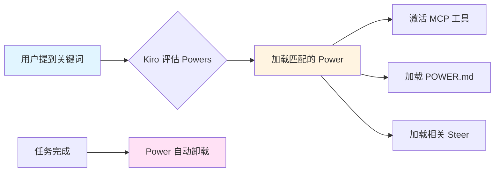
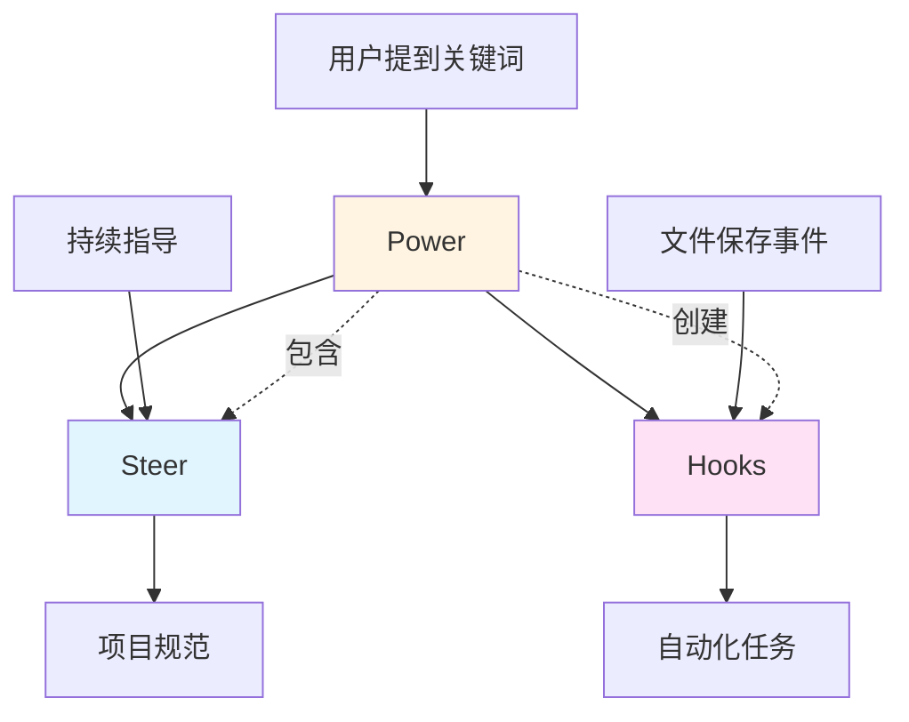
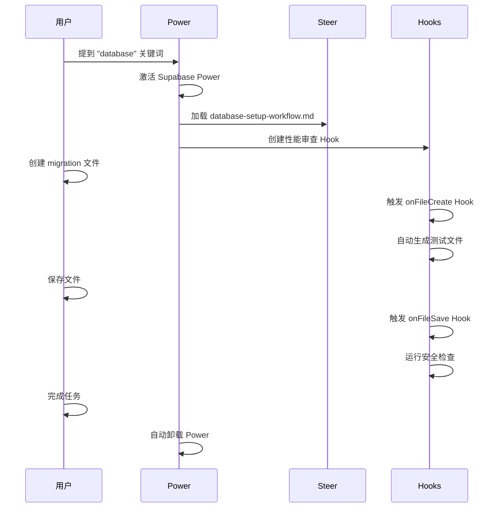
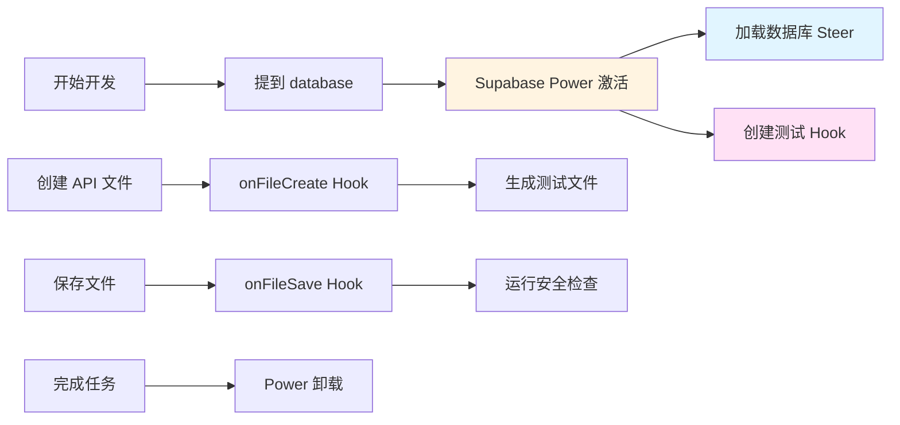

# Kiro 使用指南：Steer、Hooks、Power 详解

> 📅 **文档生成时间**：2026年01月27日 GMT+8 20:21:54  
> 🤖 **本文档由 AI 生成**  
> 📝 **AI 模型**：Composer (Cursor)

---

## 📋 目录

- [核心概念对比](#核心概念对比)
- [Steer（引导文件）](#steer引导文件)
- [Hooks（钩子）](#hooks钩子)
- [Power（能力包）](#power能力包)
- [三者配合使用](#三者配合使用)
- [最佳实践](#最佳实践)
- [实际应用场景](#实际应用场景)

---

## 🎯 核心概念对比

| 特性 | **Steer** | **Hooks** | **Power** |
|------|-----------|-----------|-----------|
| **本质** | 📝 持久化的项目知识文档 | ⚡ 事件驱动的自动化触发器 | 📦 动态加载的能力包 |
| **存储位置** | `.kiro/steering/*.md` | `.kiro/hooks/*.kiro.hook` | `.kiro/powers/` 或全局安装 |
| **触发方式** | 🔄 持续加载（基于配置） | 🎯 事件触发（文件保存、创建等） | 🔍 关键词激活（动态加载） |
| **使用频率** | ⚡ 高频（持续生效） | 📊 中频（事件发生时） | 📉 按需（提及关键词时） |
| **内容类型** | 项目规范、架构文档、最佳实践 | 自动化脚本、提示词 | MCP工具、工作流、文档 |
| **上下文消耗** | ⚠️ 持续占用（需精简） | ✅ 按需占用 | ✅ 动态加载，节省token |
| **适用场景** | 代码规范、架构模式、团队标准 | 自动化任务、质量检查 | 技术栈集成、工具链 |

---

## 📝 Steer（引导文件）

### 定义与职责

**Steer** 是存储在 `.kiro/steering/` 目录下的 Markdown 文件，用于提供**持久化的项目知识**。它比 Cursor 的 `.cursorrules` 更强大，提供结构化、可演进的文档。

### 核心职责

1. ✅ **定义项目规范**：代码风格、命名约定、架构模式
2. ✅ **文档化技术栈**：框架、库、技术约束
3. ✅ **描述项目结构**：文件组织、目录规范
4. ✅ **提供最佳实践**：团队工作流、开发模式

### 默认文件

Kiro 会自动创建三个基础文件：

| 文件 | 用途 | 示例内容 |
|------|------|----------|
| `product.md` | 产品目标、用户群体、业务目标 | 产品定位、目标用户、核心功能 |
| `tech.md` | 技术栈、框架、库、约束 | React、TypeScript、数据库选择 |
| `structure.md` | 文件组织、命名规范、架构模式 | 目录结构、组件组织方式 |

### 创建自定义 Steer

```bash
# 1. 在 Kiro 面板中导航到 Steering 部分
# 2. 点击 + 按钮创建新的 .md 文件
# 3. 使用描述性文件名（如 api-standards.md）
# 4. 使用 Refine 按钮格式化内容
```

### 配置方式（Front Matter）

```yaml
---
# 控制何时加载到交互中
inclusionMode: "always"  # 或 "on-demand"
keywords: ["api", "rest", "graphql"]  # 关键词触发
---
```

### 使用场景示例

```markdown
# .kiro/steering/api-standards.md

## API 设计规范

- 使用 RESTful 风格
- 所有 API 必须包含版本号（/api/v1/...）
- 错误响应格式：{ error: string, code: number }
- 使用 JWT 进行身份验证
```

---

## ⚡ Hooks（钩子）

### 定义与职责

**Hooks** 是**事件驱动的 AI 自动化**，当特定的开发事件发生时自动触发，执行预定义的 Agent 提示词或 Shell 命令。

### 核心职责

1. ✅ **自动化重复任务**：代码格式化、测试生成、文档更新
2. ✅ **质量保证**：代码审查、安全检查、lint 检查
3. ✅ **一致性维护**：导入清理、文件头添加、依赖管理
4. ✅ **工作流集成**：版本控制、CI/CD 集成

### 触发类型

| 触发类型 | 使用场景 | 示例 |
|---------|---------|------|
| **On file save** | 文件保存时 | 运行 lint、更新文档、格式化代码 |
| **On file create** | 文件创建时 | 生成模板、添加许可证头、创建测试文件 |
| **On file delete** | 文件删除时 | 清理相关文件、更新导入 |
| **On prompt submit** | 提示提交时 | 提供上下文、阻止某些提示、记录活动 |
| **On agent stop** | Agent 停止时 | 编译代码、格式化更改、审查修改 |
| **Manual trigger** | 手动触发 | 代码审查、安全检查、文档生成 |

### 创建 Hooks

#### 方式一：通过 UI

1. 导航到 Kiro 面板的 **Agent Hooks** 部分
2. 点击 **+** 按钮创建新 hook
3. 使用自然语言定义工作流
4. 配置设置并保存

#### 方式二：通过命令面板

```bash
Cmd + Shift + P (Mac) 或 Ctrl + Shift + P (Windows/Linux)
→ 输入 "Kiro: Open Kiro Hook UI"
```

### Hook 文件格式

```json
{
  "enabled": true,
  "name": "Auto Format on Save",
  "description": "保存文件时自动格式化代码",
  "version": "1",
  "when": {
    "type": "onFileSave",
    "pattern": "**/*.{ts,tsx,js,jsx}"
  },
  "then": {
    "type": "askAgent",
    "prompt": "格式化当前文件，确保符合项目代码规范"
  }
}
```

### 使用场景示例

#### 1. 自动测试生成

```json
{
  "when": { "type": "onFileCreate", "pattern": "**/*.ts" },
  "then": {
    "type": "askAgent",
    "prompt": "为新创建的 TypeScript 文件生成对应的测试文件"
  }
}
```

#### 2. 安全检查

```json
{
  "when": { "type": "onFileSave", "pattern": "**/*.{ts,tsx}" },
  "then": {
    "type": "askAgent",
    "prompt": "检查代码中的安全漏洞，特别是 SQL 注入和 XSS 风险"
  }
}
```

#### 3. 文档同步

```json
{
  "when": { "type": "onFileSave", "pattern": "**/api/**/*.ts" },
  "then": {
    "type": "askAgent",
    "prompt": "更新 API 文档，确保与代码同步"
  }
}
```

---

## 📦 Power（能力包）

### 定义与职责

**Power** 是**统一的能力包**，将工具、工作流和最佳实践打包成 Kiro 可以按需激活的格式。Power 包含 MCP 工具配置、工作流指导和 Steer 文件。

### 核心职责

1. ✅ **动态上下文加载**：基于关键词自动激活，节省 token
2. ✅ **技术栈集成**：集成第三方工具和框架（如 Stripe、Supabase、Neon）
3. ✅ **工具链管理**：统一管理 MCP 服务器和工具
4. ✅ **知识封装**：将专业知识打包成可复用的包

### Power 的组成

```
power-example/
├── POWER.md              # 必需：元数据、引导指令
├── mcp.json              # 可选：MCP 服务器配置
└── steering/             # 可选：工作流特定的指导文件
    ├── setup.md
    └── best-practices.md
```

### 工作原理



### POWER.md 结构

#### Front Matter（元数据）

```yaml
---
name: "supabase"
displayName: "Supabase with local CLI"
description: "使用 Supabase 构建全栈应用"
keywords: ["database", "postgres", "auth", "storage", "realtime", "supabase"]
---
```

#### Onboarding（入门步骤）

```markdown
# Onboarding

## Step 1: 验证工具
在使用 Supabase Local MCP 之前，确保：
- **Docker Desktop** 已安装并运行
- **Supabase CLI** 已安装

## Step 2: 添加 Hooks
添加性能审查 hook...
```

#### Steering（引导指令）

```markdown
# Best Practices

## 数据库模式设计
- 使用 UUID 作为主键
- 始终添加时间戳（created_at, updated_at）
- 对所有用户数据表启用 RLS
```

### 安装 Power

#### 方式一：从市场安装

1. 浏览 [kiro.dev/powers](https://kiro.dev/powers)
2. 点击 **Install** 一键安装

#### 方式二：从 GitHub 安装

1. 在 Kiro 面板中选择 **Add power from GitHub**
2. 输入 GitHub 仓库 URL

#### 方式三：本地安装

1. 创建 Power 目录结构
2. 在 Kiro 面板中选择 **Add power from Local Path**
3. 选择 Power 目录

### 使用场景示例

#### Stripe Power

```yaml
# 当用户提到 "payment" 或 "checkout" 时
keywords: ["payment", "checkout", "stripe"]
```

**激活时**：
- ✅ 加载 Stripe MCP 工具
- ✅ 加载 Stripe 最佳实践文档
- ✅ 提供支付流程指导

**完成后**：
- ✅ 自动卸载，释放上下文

#### Supabase Power

```yaml
keywords: ["database", "postgres", "auth", "storage"]
```

**激活时**：
- ✅ 加载 Supabase MCP 工具
- ✅ 加载数据库设计指导
- ✅ 提供 RLS 策略最佳实践

---

## 🔄 三者配合使用

### 协作关系图



### 典型工作流

#### 场景：使用 Supabase 开发新功能



### 配合使用示例

#### 1. Power 创建 Hooks

```markdown
# POWER.md (Supabase Power)

## Step 2: 添加 Hooks
添加一个 hook 到 `.kiro/hooks/review-advisors.kiro.hook`：

```json
{
  "enabled": true,
  "name": "Review Database Performance & Security",
  "when": { "type": "userTriggered" },
  "then": {
    "type": "askAgent",
    "prompt": "执行 get_advisors 检查性能和安全隐患"
  }
}
```
```

#### 2. Power 引用 Steer

```markdown
# POWER.md

# 何时加载 Steer 文件

- 设置数据库 → `database-setup-workflow.md`
- 编写 SQL 代码 → `supabase-code-format-sql.md`
- 创建 RLS 策略 → `supabase-database-rls-policies.md`
```

#### 3. Steer 指导 Hooks 行为

```markdown
# .kiro/steering/code-quality.md

## 代码质量规范

所有 Hook 在执行代码检查时应该：
1. 检查 TypeScript 类型安全
2. 验证 ESLint 规则
3. 确保测试覆盖率 > 80%
```

---

## ✅ 最佳实践

### Steer 最佳实践

#### ✅ 应该做的

- **保持简洁**：每个文件聚焦单一关注点
- **使用 Front Matter**：配置加载时机和关键词
- **提供示例**：包含正确和错误的代码示例
- **定期更新**：随着项目演进更新文档

#### ❌ 避免做的

- **避免过长**：单个文件不要超过 500 行
- **避免重复**：不要在多个文件中重复相同内容
- **避免过时**：及时删除不再适用的指导

### Hooks 最佳实践

#### ✅ 应该做的

- **明确具体**：编写详细、无歧义的指令
- **单一职责**：每个 Hook 专注于一个任务
- **测试充分**：部署前测试各种场景
- **限制范围**：使用精确的文件模式
- **文档化**：记录 Hook 的目的和预期行为

#### ❌ 避免做的

- **避免过于宽泛**：不要对太多文件类型触发
- **避免性能问题**：确保 Hook 不会拖慢工作流
- **避免不安全**：验证输入，处理异常情况

### Power 最佳实践

#### ✅ 应该做的

- **清晰的关键词**：使用开发者常用的术语
- **渐进式披露**：核心内容在 POWER.md，详细信息在 steering/
- **包含 Onboarding**：帮助用户快速上手
- **测试激活**：确保关键词能正确触发

#### ❌ 避免做的

- **避免关键词冲突**：确保关键词不会意外激活
- **避免过度加载**：不要加载不必要的 Steer 文件
- **避免硬编码**：使用环境变量管理配置

---

## 🎯 实际应用场景

### 场景 1：全栈开发工作流



**配置**：

1. **Power**：安装 Supabase Power
2. **Steer**：创建 `database-patterns.md`
3. **Hooks**：
   - `onFileCreate` → 生成测试
   - `onFileSave` → 安全检查

### 场景 2：代码质量保证

**目标**：确保代码质量和一致性

**配置**：

```markdown
# .kiro/steering/code-quality.md
## 代码质量标准
- TypeScript 严格模式
- ESLint 规则
- 测试覆盖率要求
```

```json
// .kiro/hooks/quality-check.kiro.hook
{
  "when": { "type": "onFileSave", "pattern": "**/*.{ts,tsx}" },
  "then": {
    "type": "askAgent",
    "prompt": "检查代码是否符合 code-quality.md 中的标准"
  }
}
```

### 场景 3：API 开发工作流

**目标**：标准化 API 开发流程

**配置**：

1. **Power**：安装 Postman Power（用于 API 测试）
2. **Steer**：
   - `api-standards.md` - API 设计规范
   - `api-testing.md` - 测试策略
3. **Hooks**：
   - `onFileCreate` (api/**/*.ts) → 生成 API 文档
   - `onFileSave` (api/**/*.ts) → 同步 Postman 集合

---

## 📊 总结对比表

| 维度 | Steer | Hooks | Power |
|------|-------|-------|-------|
| **核心价值** | 持久化知识 | 自动化任务 | 动态能力 |
| **使用频率** | 持续 | 事件驱动 | 按需 |
| **上下文成本** | 高 | 中 | 低（动态） |
| **创建难度** | 低 | 中 | 高 |
| **复用性** | 项目级 | 项目级 | 全局级 |
| **最佳场景** | 规范文档 | 自动化 | 工具集成 |

---

## 🚀 快速开始

### 第一步：设置 Steer

```bash
# 创建基础 Steer 文件
.kiro/steering/
├── product.md      # 产品目标
├── tech.md         # 技术栈
└── structure.md    # 项目结构
```

### 第二步：创建 Hooks

```bash
# 创建第一个 Hook：自动格式化
# 在 Kiro UI 中创建，或手动创建文件
.kiro/hooks/format-on-save.kiro.hook
```

### 第三步：安装 Power

```bash
# 从市场安装常用 Power
# 1. Supabase - 数据库开发
# 2. Stripe - 支付集成
# 3. Postman - API 测试
```

---

## 📚 参考资源

- [Kiro Steering 指南](https://aicodingtools.blog/en/kiro/kiro-steering-guide)
- [Kiro Hooks 文档](https://kiro.dev/docs/hooks/)
- [Kiro Powers 文档](https://kiro.dev/docs/powers/)
- [Power 创建指南](https://kiro.dev/docs/powers/create/)
- [Hooks 最佳实践](https://kiro.dev/docs/hooks/best-practices)

---

**文档结束** ✨
