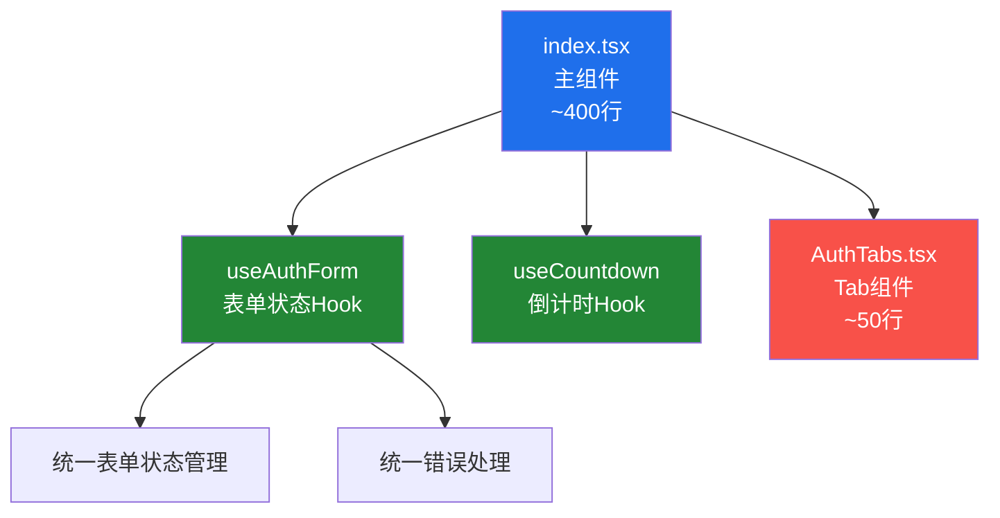

# Auth 页面优化方案 📋

> **生成时间**: 2026年01月27日 19:08:30 (GMT+8)  
> **本文档由 AI 生成** (模型: Composer)

## 📊 当前问题分析

### 1. 代码结构问题
- ❌ **文件过大**: 881行代码全部集中在一个文件中
- ❌ **状态管理分散**: 使用多个独立的 `useState`，缺乏统一管理
- ❌ **代码重复**: 表单验证逻辑和样式在多处重复

### 2. 主要痛点
- 表单字段和错误状态分开管理，容易不同步
- 倒计时逻辑可以提取复用
- Tab切换逻辑可以独立

## 🎯 优化目标

1. ✅ **适度拆分**: 只拆分真正需要独立的部分
2. ✅ **状态管理优化**: 提取Hooks统一管理表单状态
3. ✅ **代码复用**: 提取可复用的逻辑
4. ✅ **保持简洁**: 不过度拆分，主组件仍保留大部分UI逻辑

## 📐 优化方案架构



## 📁 文件结构规划

**遵循项目现有组织方式**：适度拆分，不过度

```
packages/web/src/pages/Auth/
├── index.tsx                    # 主组件（~400行，保留大部分UI逻辑）
├── useAuthForm.ts              # 表单状态管理Hook
├── useCountdown.ts              # 倒计时Hook
├── AuthTabs.tsx                 # Tab切换组件（可选）
└── types.ts                     # 类型定义（可选）
```

## 🔧 详细优化方案

### 1. 提取Hooks（核心优化）

#### 1.1 useAuthForm Hook ⭐

**职责**: 统一管理所有表单字段和错误状态

**价值**: 
- 解决表单字段和错误状态不同步的问题
- 统一表单操作接口
- 减少重复代码

```typescript
// useAuthForm.ts
export interface AuthFormData {
  email: string;
  password: string;
  confirmPassword: string;
  name: string;
  code: string;
  rememberMe: boolean;
}

export interface AuthFormErrors {
  email?: string;
  password?: string;
  confirmPassword?: string;
  name?: string;
  code?: string;
}

export interface UseAuthFormReturn {
  formData: AuthFormData;
  errors: AuthFormErrors;
  setField: (field: keyof AuthFormData, value: any) => void;
  setFields: (fields: Partial<AuthFormData>) => void;
  setError: (field: keyof AuthFormErrors, error: string) => void;
  clearErrors: () => void;
  clearField: (field: keyof AuthFormData) => void;
  reset: () => void;
}

export function useAuthForm(): UseAuthFormReturn {
  const [formData, setFormData] = useState<AuthFormData>({
    email: '',
    password: '',
    confirmPassword: '',
    name: '',
    code: '',
    rememberMe: false,
  });
  
  const [errors, setErrors] = useState<AuthFormErrors>({});
  
  // 初始化时读取记住的邮箱
  useEffect(() => {
    const savedEmail = localStorage.getItem('rememberedEmail');
    if (savedEmail) {
      setFormData(prev => ({ ...prev, email: savedEmail, rememberMe: true }));
    }
  }, []);
  
  const setField = useCallback((field: keyof AuthFormData, value: any) => {
    setFormData(prev => ({ ...prev, [field]: value }));
    // 清除对应字段的错误
    if (errors[field as keyof AuthFormErrors]) {
      setErrors(prev => {
        const next = { ...prev };
        delete next[field as keyof AuthFormErrors];
        return next;
      });
    }
  }, [errors]);
  
  const setFields = useCallback((fields: Partial<AuthFormData>) => {
    setFormData(prev => ({ ...prev, ...fields }));
  }, []);
  
  const setError = useCallback((field: keyof AuthFormErrors, error: string) => {
    setErrors(prev => ({ ...prev, [field]: error }));
  }, []);
  
  const clearErrors = useCallback(() => {
    setErrors({});
  }, []);
  
  const clearField = useCallback((field: keyof AuthFormData) => {
    setFormData(prev => ({ 
      ...prev, 
      [field]: field === 'rememberMe' ? false : '' 
    }));
  }, []);
  
  const reset = useCallback(() => {
    setFormData({
      email: '',
      password: '',
      confirmPassword: '',
      name: '',
      code: '',
      rememberMe: false,
    });
    setErrors({});
  }, []);
  
  return {
    formData,
    errors,
    setField,
    setFields,
    setError,
    clearErrors,
    clearField,
    reset,
  };
}
```

#### 1.2 useCountdown Hook

**职责**: 倒计时逻辑（参考 `useDateSwitching.ts` 的风格）

```typescript
// useCountdown.ts
export interface UseCountdownReturn {
  countdown: number;
  start: (seconds?: number) => void;
  reset: () => void;
  isActive: boolean;
}

export function useCountdown(initialSeconds: number = 60): UseCountdownReturn {
  const [countdown, setCountdown] = useState(0);
  
  useEffect(() => {
    if (countdown > 0) {
      const timer = setTimeout(() => setCountdown(countdown - 1), 1000);
      return () => clearTimeout(timer);
    }
  }, [countdown]);
  
  const start = useCallback((seconds?: number) => {
    setCountdown(seconds ?? initialSeconds);
  }, [initialSeconds]);
  
  const reset = useCallback(() => {
    setCountdown(0);
  }, []);
  
  return {
    countdown,
    start,
    reset,
    isActive: countdown > 0,
  };
}
```

### 2. 组件拆分（可选）

#### 2.1 AuthTabs 组件（可选拆分）

**是否拆分**: 可选，如果Tab逻辑简单可以保留在主组件中

**如果拆分**:
```typescript
// AuthTabs.tsx
interface AuthTabsProps {
  tab: 'code' | 'password';
  onChange: (tab: 'code' | 'password') => void;
  showTabs: boolean;
}

export default function AuthTabs({ tab, onChange, showTabs }: AuthTabsProps) {
  if (!showTabs) return null;
  
  return (
    <div className="flex border-b border-[#30363d]">
      <button
        onClick={() => onChange('code')}
        className={`flex-1 px-4 py-3 text-sm font-medium transition-colors flex items-center justify-center gap-2 ${
          tab === 'code'
            ? 'text-[#f0f6fc] border-b-2 border-[#1f6feb]'
            : 'text-[#8b949e] hover:text-[#c9d1d9]'
        }`}
      >
        📧 验证码登录
      </button>
      <button
        onClick={() => onChange('password')}
        className={`flex-1 px-4 py-3 text-sm font-medium transition-colors flex items-center justify-center gap-2 ${
          tab === 'password'
            ? 'text-[#f0f6fc] border-b-2 border-[#1f6feb]'
            : 'text-[#8b949e] hover:text-[#c9d1d9]'
        }`}
      >
        🔑 密码登录
      </button>
    </div>
  );
}
```

### 3. 主组件优化（index.tsx）

**优化后结构**:
- 保留所有表单渲染逻辑（不拆分）
- 使用 `useAuthForm` 统一管理表单状态
- 使用 `useCountdown` 管理倒计时
- 可选：使用 `AuthTabs` 组件

**代码量**: 从 881行 → ~400行（减少55%）

**示例结构**:
```typescript
export default function Auth() {
  const navigate = useNavigate();
  const auth = useAuth();
  
  // 使用Hooks管理状态
  const form = useAuthForm();
  const countdown = useCountdown();
  const [tab, setTab] = useState<'code' | 'password'>('code');
  const [pageState, setPageState] = useState<PageState>('input-email');
  const [loading, setLoading] = useState(false);
  
  // 业务逻辑函数（保持不变）
  const handleSendLoginCode = async () => {
    const error = validateEmail(form.formData.email);
    if (error) {
      form.setError('email', error);
      return;
    }
    // ...
  };
  
  // 渲染函数（保持不变，但使用form.formData和form.errors）
  const renderInputEmail = () => (
    <div className="space-y-4">
      <div>
        <label>邮箱</label>
        <input
          value={form.formData.email}
          onChange={(e) => form.setField('email', e.target.value)}
          // ...
        />
        {form.errors.email && <p>{form.errors.email}</p>}
      </div>
      {/* ... */}
    </div>
  );
  
  return (
    <div className="...">
      <AuthTabs tab={tab} onChange={setTab} showTabs={...} />
      <div className="p-6">
        {renderContent()}
      </div>
    </div>
  );
}
```

## 📈 优化效果预期

### 代码量对比

| 指标 | 优化前 | 优化后 | 改善 |
|------|--------|--------|------|
| 主文件行数 | 881行 | ~400行 | ⬇️ 55% |
| Hooks数量 | 0个 | 2个 | ⬆️ 逻辑复用 |
| 组件数量 | 1个 | 1-2个 | 适度拆分 |
| 状态管理 | 分散 | 统一 | ⬆️ 显著提升 |

### 优化收益

- ✅ **状态管理统一**: 表单字段和错误状态统一管理，避免不同步
- ✅ **代码复用**: 倒计时逻辑可复用
- ✅ **可维护性**: 主组件代码量减少，逻辑更清晰
- ✅ **不过度拆分**: 保持主组件包含主要UI逻辑，符合项目风格

## 🚀 实施步骤

### Phase 1: 提取Hooks 🔧
1. ✅ 实现 `useCountdown.ts`（最简单，先做）
2. ✅ 实现 `useAuthForm.ts`（核心优化）

### Phase 2: 可选组件拆分 🎨
1. ⚠️ 可选：实现 `AuthTabs.tsx`（如果Tab逻辑复杂）

### Phase 3: 重构主组件 🔄
1. ✅ 创建 `Auth/index.tsx`
2. ✅ 集成 `useAuthForm` 和 `useCountdown`
3. ✅ 替换所有表单状态管理为Hook调用
4. ✅ 测试功能完整性
5. ✅ 删除旧的 `Auth.tsx` 文件

### Phase 4: 优化和测试 ✨
1. ✅ 代码审查
2. ✅ 功能测试
3. ✅ 性能优化

## 📋 实施注意事项

### 1. 拆分原则
- ✅ **只拆分真正需要的部分**: Hooks提取状态逻辑，组件只拆分独立UI
- ✅ **保持主组件完整**: 表单渲染逻辑保留在主组件中
- ✅ **符合项目风格**: 参考 Home、DailyLog 页面的组织方式

### 2. 状态管理优化重点
- ✅ **统一表单状态**: 使用 `useAuthForm` 统一管理所有表单字段
- ✅ **统一错误处理**: 错误状态与表单字段同步管理
- ✅ **减少重复代码**: 表单操作统一接口

### 3. 向后兼容
- ✅ **功能一致性**: 确保重构后功能完全一致
- ✅ **路由不变**: 保持路由路径不变
- ✅ **API不变**: 保持与 `AuthContext` 的交互方式不变

## 🔍 参考项目现有模式

### Home页面（723行）
- ✅ 只有2个Hooks：`useEditor.ts`, `useGeneration.ts`
- ✅ 没有拆分子组件，所有UI逻辑在主组件中

### DailyLog页面（202行）
- ✅ 只有2个Hooks：`useDateSwitching.ts`, `useExportRange.ts`
- ✅ 没有拆分子组件

### PromptPlaza页面
- ✅ 有3个子组件，但都是独立的业务组件（TemplateCard, TemplateDetail, CommentSection）

**Auth页面将遵循相同的适度拆分原则** ✅

## 📝 总结

本次优化采用**适度拆分**策略：
1. **核心优化**: 提取 `useAuthForm` Hook统一管理表单状态（最重要）
2. **辅助优化**: 提取 `useCountdown` Hook复用倒计时逻辑
3. **可选拆分**: Tab组件可选拆分
4. **保持简洁**: 主组件保留大部分UI逻辑，代码量从881行减少到~400行

这样既解决了状态管理分散的问题，又保持了代码结构的简洁，符合项目的代码组织风格。
