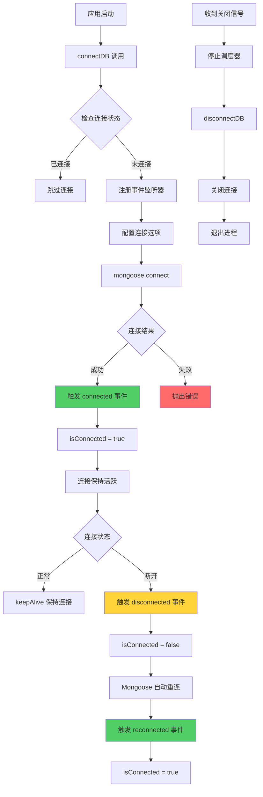
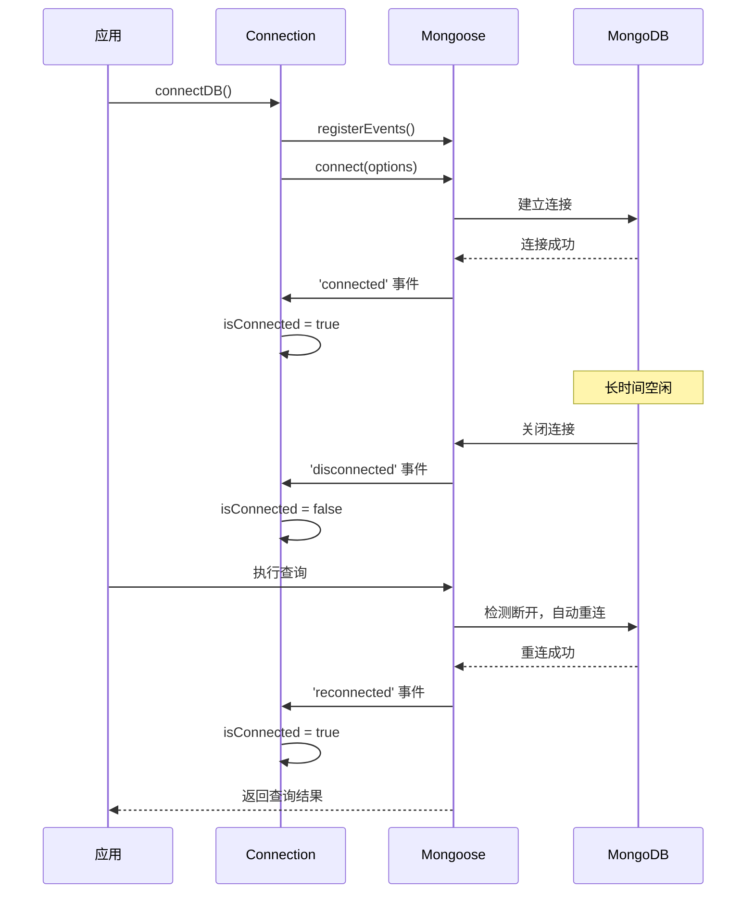

# MongoDB 长连接优化方案 📋

## 📌 方案概述

优化 MongoDB 连接管理，保持长连接，提升应用稳定性和性能。

## 🎯 目标

1. ✅ **保持长连接**：防止连接被服务器端或网络设备关闭
2. ✅ **状态同步**：确保连接状态标志与实际状态一致
3. ✅ **防止重复注册**：避免事件监听器重复注册导致内存泄漏
4. ✅ **优雅关闭**：确保服务关闭时正确断开数据库连接
5. ✅ **连接健康检查**：增强健康检查接口，包含数据库连接状态

---

## 📊 方案对比

| 项目 | 当前状态 | 优化后 |
|------|---------|--------|
| 连接保持 | ❌ 无配置，可能被断开 | ✅ 配置 keepAlive，保持长连接 |
| 状态同步 | ❌ 断开后状态不同步 | ✅ 监听所有连接事件，状态准确 |
| 事件监听 | ⚠️ 可能重复注册 | ✅ 使用标志位防止重复注册 |
| 优雅关闭 | ❌ 未断开数据库连接 | ✅ 正确断开数据库连接 |
| 健康检查 | ⚠️ 仅检查服务状态 | ✅ 包含数据库连接状态 |

---

## 🔧 具体改动

### 1. 连接配置优化 (`packages/server/src/db/connection.ts`)

#### 1.1 添加连接选项

```typescript
// 连接选项配置
const connectionOptions: mongoose.ConnectOptions = {
  // 连接池配置
  maxPoolSize: 10,              // 最大连接数
  minPoolSize: 2,               // 最小连接数（保持最小连接池）
  
  // 连接超时配置
  serverSelectionTimeoutMS: 5000,  // 服务器选择超时（5秒）
  socketTimeoutMS: 45000,          // Socket 超时（45秒）
  connectTimeoutMS: 10000,         // 连接超时（10秒）
  
  // 保持连接活跃
  keepAlive: true,                 // 启用 TCP keepAlive
  keepAliveInitialDelay: 30000,    // 初始延迟 30 秒后开始发送 keepAlive
  
  // 重试配置
  retryWrites: true,               // 启用写入重试
  retryReads: true,                // 启用读取重试
};
```

#### 1.2 修复状态同步问题

```typescript
// 添加事件监听器标志，防止重复注册
let eventListenersRegistered = false;

// 注册连接事件监听器（只注册一次）
function registerConnectionEvents() {
  if (eventListenersRegistered) {
    return;
  }
  
  mongoose.connection.on('connected', () => {
    isConnected = true;
    logger.success('MongoDB 连接已建立');
  });

  mongoose.connection.on('reconnected', () => {
    isConnected = true;
    logger.info('MongoDB 已重新连接');
  });

  mongoose.connection.on('disconnected', () => {
    isConnected = false;
    logger.warn('MongoDB 连接已断开');
  });

  mongoose.connection.on('error', (error) => {
    logger.error('MongoDB 连接错误', error);
  });

  eventListenersRegistered = true;
}
```

#### 1.3 更新连接函数

```typescript
export async function connectDB(): Promise<void> {
  // 如果已经连接，检查实际状态
  if (isConnected && mongoose.connection.readyState === 1) {
    logger.debug('已连接，跳过重复连接');
    return;
  }

  try {
    // 设置 Mongoose 配置
    mongoose.set('strictQuery', true);

    // 注册事件监听器（在连接前注册，确保能捕获所有事件）
    registerConnectionEvents();

    // 连接数据库（使用配置选项）
    await mongoose.connect(MONGODB_URI, connectionOptions);
    
    // 注意：isConnected 会在 'connected' 事件中设置为 true
    // 但为了确保，这里也设置一次
    if (mongoose.connection.readyState === 1) {
      isConnected = true;
    }

    logger.success('MongoDB 连接成功');
    logger.info(`连接地址: ${MONGODB_URI.replace(/\/\/.*:.*@/, '//*****:*****@')}`);
    
  } catch (error) {
    logger.error('MongoDB 连接失败', error as Error);
    throw error;
  }
}
```

---

### 2. 优雅关闭优化 (`packages/server/src/index.ts`)

#### 2.1 导入 disconnectDB

```typescript
import { connectDB, disconnectDB } from './db/connection.js';
```

#### 2.2 更新优雅关闭处理

```typescript
// 优雅关闭处理函数
async function gracefulShutdown(signal: string) {
  logger.info(`收到 ${signal} 信号，正在关闭服务...`);
  
  try {
    // 停止提醒调度器
    cloudReminderScheduler.stop();
    
    // 断开数据库连接
    await disconnectDB();
    
    logger.info('服务已优雅关闭');
    process.exit(0);
  } catch (error) {
    logger.error('关闭服务时出错', error as Error);
    process.exit(1);
  }
}

// 注册信号处理器
process.on('SIGINT', () => gracefulShutdown('SIGINT'));
process.on('SIGTERM', () => gracefulShutdown('SIGTERM'));
```

---

### 3. 健康检查增强 (`packages/server/src/index.ts`)

#### 3.1 导入连接状态检查函数

```typescript
import { connectDB, disconnectDB, isDBConnected } from './db/connection.js';
```

#### 3.2 更新健康检查接口

```typescript
// 健康检查
app.get('/api/health', (_req, res) => {
  const dbConnected = isDBConnected();
  
  res.status(dbConnected ? 200 : 503).json({
    status: dbConnected ? 'ok' : 'degraded',
    message: 'WeekNote API is running',
    mongodb: {
      connected: dbConnected,
      uri: MONGODB_URI.replace(/\/\/([^:]+):([^@]+)@/, '//***:***@'),
    },
    timestamp: new Date().toISOString(),
  });
});
```

---

## 📝 改动文件清单

| 文件 | 改动类型 | 说明 |
|------|---------|------|
| `packages/server/src/db/connection.ts` | 🔄 重构 | 添加连接选项、修复状态同步、防止重复注册 |
| `packages/server/src/index.ts` | ✏️ 修改 | 完善优雅关闭、增强健康检查 |

---

## 🔍 配置参数说明

### 连接池配置

| 参数 | 值 | 说明 |
|------|-----|------|
| `maxPoolSize` | 10 | 最大连接数，适合中小型应用 |
| `minPoolSize` | 2 | 最小连接数，保持基础连接池 |

### 超时配置

| 参数 | 值 | 说明 |
|------|-----|------|
| `serverSelectionTimeoutMS` | 5000 | 服务器选择超时 5 秒 |
| `socketTimeoutMS` | 45000 | Socket 超时 45 秒（略小于 MongoDB 默认 60 秒） |
| `connectTimeoutMS` | 10000 | 连接超时 10 秒 |

### KeepAlive 配置

| 参数 | 值 | 说明 |
|------|-----|------|
| `keepAlive` | true | 启用 TCP keepAlive |
| `keepAliveInitialDelay` | 30000 | 30 秒后开始发送 keepAlive 包 |

---

## 🎨 流程图

### 连接生命周期



### 状态同步机制



---

## ✅ 预期效果

### 优化前

- ❌ 连接可能被服务器端关闭
- ❌ 状态标志不准确，日志误导
- ❌ 首次查询可能有重连延迟
- ❌ 优雅关闭时未断开数据库

### 优化后

- ✅ 连接保持活跃，不会被意外关闭
- ✅ 状态标志准确，日志真实反映连接状态
- ✅ 查询无延迟，连接池保持最小连接
- ✅ 优雅关闭，资源正确释放

---

## 🧪 测试建议

### 1. 连接保持测试

```bash
# 启动服务后，等待一段时间（如 1 小时）
# 检查日志，确认没有 "连接已断开" 的警告
```

### 2. 状态同步测试

```bash
# 手动断开 MongoDB 连接（如重启 MongoDB）
# 检查日志，确认：
# 1. 出现 "连接已断开" 警告
# 2. 执行查询时自动重连
# 3. 出现 "已重新连接" 信息
# 4. 状态标志正确更新
```

### 3. 健康检查测试

```bash
# 访问 /api/health
# 正常情况：status: "ok", mongodb.connected: true
# 断开情况：status: "degraded", mongodb.connected: false
```

### 4. 优雅关闭测试

```bash
# 发送 SIGTERM 信号
kill -SIGTERM <pid>
# 检查日志，确认：
# 1. 调度器已停止
# 2. 数据库连接已断开
# 3. 服务正常退出
```

---

## ⚠️ 注意事项

1. **环境变量**：当前方案不需要新增环境变量，所有配置使用默认值
2. **向后兼容**：改动完全向后兼容，不影响现有功能
3. **性能影响**：保持最小连接池会占用少量资源，但提升响应速度
4. **监控建议**：建议监控连接池使用情况，根据实际负载调整 `maxPoolSize`

---

## 📚 参考资料

- [Mongoose Connection Options](https://mongoosejs.com/docs/connections.html#options)
- [MongoDB Connection String Options](https://www.mongodb.com/docs/manual/reference/connection-string/#connection-string-options)
- [TCP KeepAlive](https://en.wikipedia.org/wiki/Keepalive)

---

## ✍️ 审核要点

请重点审核以下内容：

1. ✅ **连接选项配置**：参数值是否合理？
2. ✅ **状态同步逻辑**：事件监听是否正确？
3. ✅ **优雅关闭流程**：是否完整？
4. ✅ **健康检查增强**：是否需要？
5. ✅ **测试方案**：是否充分？

---

**方案制定时间**：2026-01-21  
**方案状态**：待审核 ⏳
