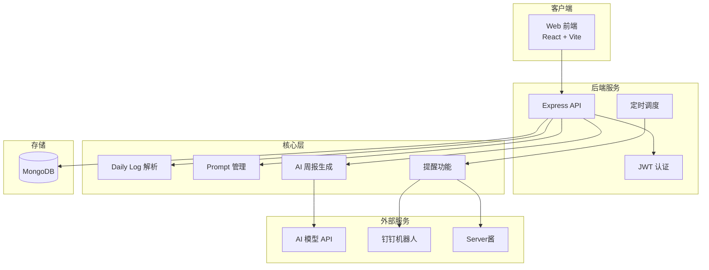
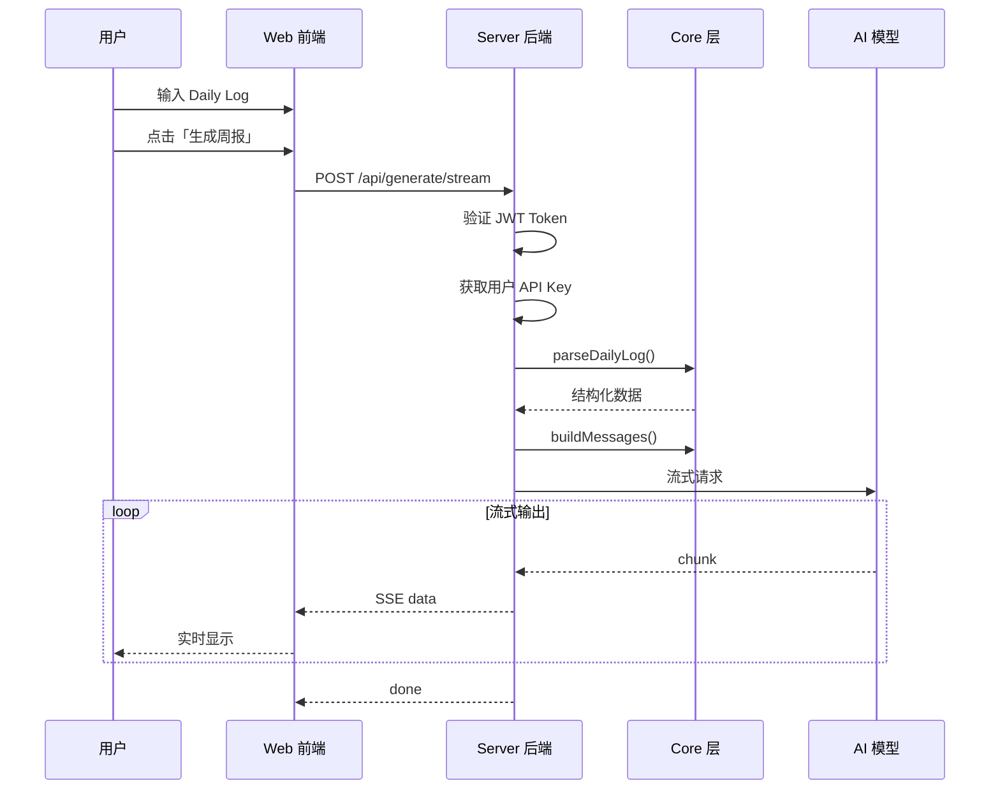

# WeekNote 技术方案文档

## 1. 项目概述

**目标**：将工程师日常 Daily Log 自动整理为结构清晰、可提交的周报。

**核心理念**：
- 平台无关的「周报生成核心能力」（Core Layer）
- 多用户云端版本（Server + Web）
- V1 优先稳定与可控

---

## 2. 系统架构



---

## 3. 包结构

```
weeknote/
├── packages/
│   ├── core/        # 核心逻辑（平台无关）
│   ├── server/      # 后端 API 服务
│   ├── web/         # 前端 Web 应用
│   └── cli/         # 命令行工具（存档）
├── scripts/         # 启动脚本
└── docs/            # 文档
```

---

## 4. Core 层设计

### 4.1 模块划分

| 模块 | 路径 | 功能 |
|------|------|------|
| parser | `core/src/parser/` | Daily Log 文本解析 |
| prompt | `core/src/prompt/` | Prompt 模板与消息构建 |
| generator | `core/src/generator/` | AI 模型调用与周报生成 |
| daily-log | `core/src/daily-log/` | 每日记录工具 |
| reminder | `core/src/reminder/` | 提醒功能 |

### 4.2 Daily Log 解析

**输入格式**：
```markdown
12-23 | 周一
Plan
- 任务 1

Result
- 完成内容 1

Issues
- 遇到的问题

Notes
- 备注
```

**输出结构**：
```typescript
interface WeeklyLog {
  days: DayLog[];
  rawText: string;
}

interface DayLog {
  date: string;      // "12-23"
  dayOfWeek: string; // "周一"
  plan: string[];
  result: string[];
  issues: string[];
  notes: string[];
}
```

### 4.3 AI 生成器

**支持的模型**：

| 平台 | 模型 |
|------|------|
| 硅基流动 | Qwen2.5-7B-Instruct 等（免费） |
| DeepSeek | deepseek-chat |
| 豆包 | seed-1.6 等 |
| OpenAI | gpt-4o, gpt-4o-mini |

---

## 5. Server 层设计

### 5.1 技术选型

| 组件 | 技术 |
|------|------|
| 框架 | Express.js |
| 数据库 | MongoDB + Mongoose |
| 认证 | JWT (jsonwebtoken) |
| 密码加密 | bcryptjs |
| 定时任务 | node-cron |

### 5.2 数据模型

| 模型 | 说明 |
|------|------|
| User | 用户（邮箱、密码、配置） |
| DailyLog | 每日记录 |
| PromptTemplate | Prompt 模板 |
| GenerationHistory | 生成历史 |

### 5.3 API 模块

| 路由 | 功能 |
|------|------|
| `/api/auth` | 用户认证 |
| `/api/daily-logs` | 每日记录 |
| `/api/prompts` | Prompt 模板 |
| `/api/generate` | 周报生成 |
| `/api/config` | 用户配置 |
| `/api/reminder` | 提醒配置 |

---

## 6. Web 层设计

### 6.1 技术选型

| 组件 | 技术 |
|------|------|
| 框架 | React 18 |
| 构建 | Vite 5 |
| 样式 | TailwindCSS |
| UI 组件 | Radix UI + shadcn/ui |
| 编辑器 | Milkdown |
| 路由 | React Router v6 |

### 6.2 页面结构

| 页面 | 路径 | 功能 |
|------|------|------|
| 首页 | `/` | Daily Log 输入 + 周报生成 |
| 每日记录 | `/daily` | 日历选择 + 记录编辑 |
| 登录/注册 | `/auth` | 用户认证 |
| 设置 | `/settings/*` | API Key、Prompt、提醒 |

---

## 7. 周报生成流程



---

## 8. 认证设计

### JWT Token 机制

| Token | 用途 | 有效期 |
|-------|------|--------|
| Access Token | API 请求认证 | 7 天 |
| Refresh Token | 刷新 Access Token | 30 天 |

---

## 9. 关键源码索引

| 模块 | 文件路径 |
|------|---------|
| Daily Log 解析 | `packages/core/src/parser/index.ts` |
| Prompt 组装 | `packages/core/src/prompt/index.ts` |
| AI 生成器 | `packages/core/src/generator/generator.ts` |
| 模型管理 | `packages/core/src/generator/model-manager.ts` |
| 生成 API | `packages/server/src/routes/generation.ts` |
| 前端首页 | `packages/web/src/pages/Home.tsx` |

---

## 10. 输出格式

```markdown
【本周工作总结】
- 项目A：
  - 完成了 xxx
  - 优化了 xxx

【本周输出成果（Deliverables）】
- ✓ 功能模块上线
- ✓ 文档更新

【问题 & 风险（Issues & Risks）】
- 问题 1：xxx
  - 影响：xxx

【下周工作计划】
- 计划 1：xxx
- 计划 2：xxx
```

---

## 11. 后续演进方向

| 方向 | 说明 |
|------|------|
| 生产部署 | Docker 容器化、云平台部署 |
| 文档适配器 | 语雀、Notion 集成 |
| CLI 复活 | CLI 连接云端 API |
| 数据分析 | 工作量统计、趋势分析 |
