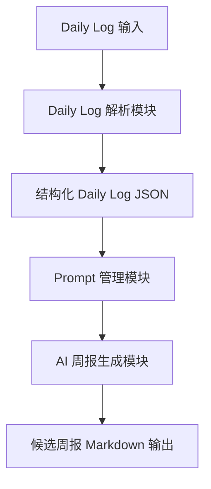
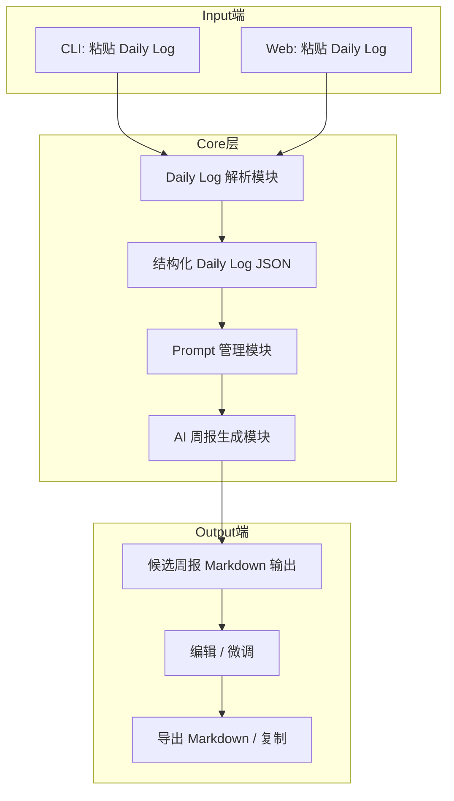

# Weekly Report Optimizer 技术方案文档（V1）
## 1. 项目概述
**目标**：将工程师日常 Daily Log 自动整理为结构清晰、可提交的周报，提高周报生成效率，降低人工操作成本。

**核心理念**：

+ 平台无关的「周报生成核心能力」（Core Layer）
+ 可选的「文档系统适配层」（Adapter Layer）
+ V1 优先稳定与可控，不涉及多人协作、自动化发送或第三方平台强绑定

**交互方式**：

+ **CLI**：快速粘贴 Daily Log → 生成周报 → 可预览与编辑
+ **Web**：基于浏览器的可视化操作，支持 Markdown 编辑与实时预览

---

## 2. 系统架构
```mermaid
flowchart TD
    A[文档系统适配层 (Adapter)] -->|可选| B[Weekly Report Core]
    B --> C[CLI & Web Interface]
    C --> D[用户输入 Daily Log]
    D --> B
    B --> E[候选周报生成]
    E --> C
    C --> F[Markdown 输出 / 复制 / 编辑]
```

---

## 3. Core 层内部数据流


---

## 4. 端到端完整流程图


---

## 5. 数据处理与脱敏
+ V1 不涉及敏感信息脱敏，默认处理用户粘贴的 Daily Log
+ 支持 Markdown / 纯文本输入
+ Notes 权重低，可选保留
+ 后续可增加 Adapter 层实现自动读取/写入内网文档

---

## 6. 技术选型建议
| 模块 | 技术栈建议 |
| --- | --- |
| CLI | Node.js + Commander.js / Python + Click |
| Web 前端 | React + TailwindCSS + Markdown 编辑器（如 `react-markdown` 或 `@uiw/react-md-editor`） |
| AI 调用 | OpenAI API / 本地大模型接口（如 LLaMA 7B） |
| Markdown 渲染 | remark / react-markdown |
| 数据结构处理 | JSON + 内存缓存 |
| 打包/部署 | CLI：npm 发布，Web：Vercel/Netlify 或内部服务器 |


---

## 7. 部署与运维
+ **CLI**：
    - 本地安装
    - 可通过 npm / pip 发布
+ **Web**：
    - 静态前端 + API 后端调用 Core 层
    - 后端可 Node.js / Python Flask / FastAPI
+ **日志与监控**：
    - CLI 可输出 debug 日志
    - Web 可收集错误日志，用于排查 AI 调用异常

---

## 8. 非功能需求
+ **可控性**：AI 输出候选稿，不带元信息
+ **易用性**：操作路径 ≤ 2 步（粘贴 → 生成）
+ **稳定性**：每日 Daily Log 粘贴即可生成，不依赖外部平台
+ **可扩展性**：后续可接入 Adapter 层实现自动同步

---

## 9. 风险与限制
+ AI 输出质量依赖 Daily Log 完整性与质量
+ Notes 过多可能干扰整理结果
+ Prompt 规则需持续调优
+ V1 不提供多人协作与自动发送

---

## 10. V1 成功标准
+ 连续 2 周使用工具生成周报，仅需少量人工调整
+ 明显减少 Prompt 复制与多平台切换成本
+ CLI 与 Web 输出结果一致

---

## 11. 后续演进方向（非 V1）
+ 文档系统适配器（内网语雀 / Notion）
+ 多周上下文感知与连续事项识别
+ Prompt 规则配置化
+ 与经验沉淀 / 技术方案生成模块共享核心能力

