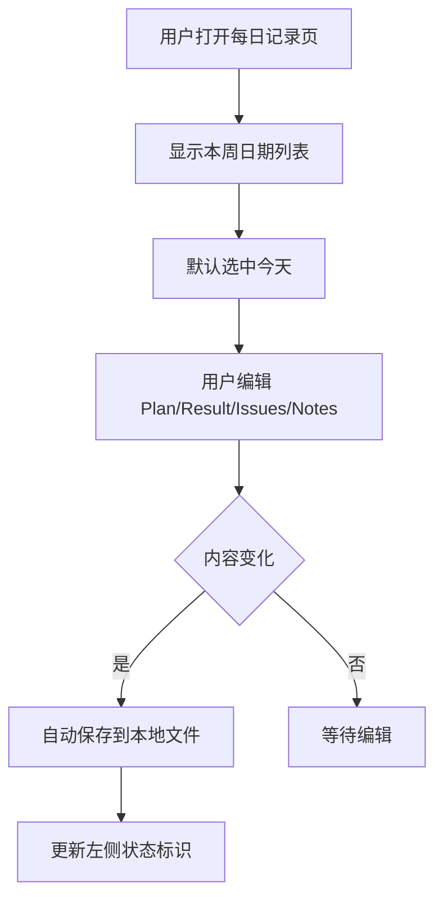
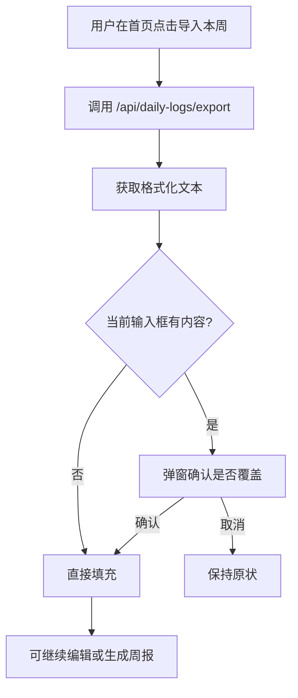
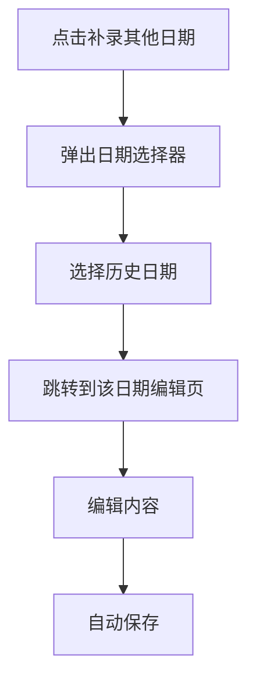

# 每日记录功能方案

> 版本：V1.0  
> 日期：2024-12-24  
> 状态：待审核

---

## 1. 背景与动机

### 1.1 当前痛点

用户目前的工作流程是：
1. 在其他平台（如语雀）记录每日工作内容
2. 周五时复制整周内容粘贴到 WeekNote 生成周报

存在的问题：
- 需要在多个平台之间切换
- 记录格式可能不符合系统期望，需要手动调整
- 容易遗忘记录，周五时需要回忆整周工作

### 1.2 目标

在 WeekNote 系统中直接支持每日工作记录，实现：
- **一站式体验**：记录和生成周报在同一系统完成
- **格式一致**：记录时即按系统期望格式输入
- **历史可查**：可浏览和编辑历史记录
- **便捷导入**：一键将本周记录导入首页生成周报

---

## 2. 功能概述

### 2.1 核心功能

| 功能 | 说明 |
|------|------|
| 每日记录 | 按 Plan/Result/Issues/Notes 分区输入当天工作内容 |
| 历史浏览 | 按周分组查看历史记录 |
| 补录支持 | 可选择任意历史日期补录内容 |
| 导出导入 | 一键将本周记录导入首页用于生成周报 |
| 自动保存 | 实时保存，防止数据丢失 |

### 2.2 非功能需求

- 数据本地存储，无需联网
- 按周分文件，便于管理和备份
- 支持长期存储，可追溯历史

---

## 3. 存储设计

### 3.1 目录结构

```
~/.weeknote/
├── config.json           # 现有：API Key 等配置
├── prompts.json          # 现有：Prompt 模板
└── dailyLog/             # 新增：每日日志存储目录
    ├── 2024-W51_12-16~12-22.json
    ├── 2024-W52_12-23~12-29.json
    └── 2025-W01_12-30~01-05.json
```

### 3.2 文件命名规范

```
{年份}-W{周数}_{起始月-日}~{结束月-日}.json

示例：
2024-W52_12-23~12-29.json
2025-W01_12-30~01-05.json
```

说明：
- 使用 ISO 周数（W01-W53）
- 避免使用特殊字符（如 `|`），确保跨平台兼容
- 周范围为周一到周日（7 天）

### 3.3 JSON 数据结构

```typescript
/**
 * 单条每日记录
 */
interface DailyRecord {
  /** 日期 ISO 格式 "2024-12-23" */
  date: string;
  /** 星期几 "周一" */
  dayOfWeek: string;
  /** 计划内容 */
  plan: string[];
  /** 完成结果 */
  result: string[];
  /** 遇到的问题 */
  issues: string[];
  /** 备注 */
  notes: string[];
  /** 创建时间 ISO 格式 */
  createdAt: string;
  /** 更新时间 ISO 格式 */
  updatedAt: string;
}

/**
 * 周日志文件结构
 */
interface WeeklyLogFile {
  /** 文件版本，便于后续数据迁移 */
  version: 1;
  /** 年份 */
  year: number;
  /** ISO 周数 */
  week: number;
  /** 周起始日期（周一）"2024-12-23" */
  weekStart: string;
  /** 周结束日期（周日）"2024-12-29" */
  weekEnd: string;
  /** 按日期索引的记录 */
  days: Record<string, DailyRecord>;
  /** 文件创建时间 */
  createdAt: string;
  /** 文件更新时间 */
  updatedAt: string;
}
```

### 3.4 示例 JSON 文件

```json
{
  "version": 1,
  "year": 2024,
  "week": 52,
  "weekStart": "2024-12-23",
  "weekEnd": "2024-12-29",
  "days": {
    "2024-12-23": {
      "date": "2024-12-23",
      "dayOfWeek": "周一",
      "plan": [
        "完成峰谷电价图开发",
        "hb-yuque-desensiter 项目推进"
      ],
      "result": [
        "完成峰谷电价组件封装",
        "初步完成 hb-yuque-desensiter 项目"
      ],
      "issues": [
        "md 格式导出语雀无法自动同步分栏组件样式"
      ],
      "notes": [],
      "createdAt": "2024-12-23T09:00:00.000Z",
      "updatedAt": "2024-12-23T18:30:00.000Z"
    },
    "2024-12-24": {
      "date": "2024-12-24",
      "dayOfWeek": "周二",
      "plan": [
        "国际化组件接入规划"
      ],
      "result": [
        "整理文档",
        "完成周报工具初版"
      ],
      "issues": [],
      "notes": [],
      "createdAt": "2024-12-24T09:00:00.000Z",
      "updatedAt": "2024-12-24T17:00:00.000Z"
    }
  },
  "createdAt": "2024-12-23T09:00:00.000Z",
  "updatedAt": "2024-12-24T17:00:00.000Z"
}
```

---

## 4. 日期系统设计

### 4.1 设计原则

> **简单优先，控制权交给用户**

- 默认展示周一到周日全部 7 天
- 用户自主决定哪天记录、哪天跳过
- 系统只关注「有没有内容」，不判断「应不应该有」
- 不引入复杂的节假日系统

### 4.2 日期展示规则

| 类型 | 展示规则 |
|------|---------|
| 工作日（周一~周五） | 默认展开显示 |
| 周末（周六~周日） | 默认折叠，有记录时自动展开 |

### 4.3 记录状态标识

| 状态 | 图标 | 判断条件 |
|------|------|---------|
| 已记录 | ● 绿色 | 有任意内容（plan/result/issues/notes） |
| 未记录 | ○ 灰色 | 无任何内容 |

### 4.4 日期工具函数

```typescript
// packages/core/src/daily-log/date-utils.ts

const WEEKDAY_NAMES = ['周日', '周一', '周二', '周三', '周四', '周五', '周六'];

/**
 * 获取日期的星期几
 */
function getDayOfWeek(date: Date | string): string {
  const d = typeof date === 'string' ? new Date(date) : date;
  return WEEKDAY_NAMES[d.getDay()];
}

/**
 * 判断是否为周末
 */
function isWeekend(date: Date | string): boolean {
  const d = typeof date === 'string' ? new Date(date) : date;
  const day = d.getDay();
  return day === 0 || day === 6;
}

/**
 * 获取某周的所有日期（周一到周日）
 */
function getWeekDates(weekStart: string): Array<{
  date: string;
  dayOfWeek: string;
  isWeekend: boolean;
}>;

/**
 * 获取本周的周一日期
 */
function getWeekStart(date?: Date): string;

/**
 * 获取周文件名
 */
function getWeekFileName(date: Date | string): string;

/**
 * 格式化日期显示 "12-23"
 */
function formatShortDate(date: string): string;
```

---

## 5. API 设计

### 5.1 接口列表

| 方法 | 路径 | 说明 |
|------|------|------|
| GET | `/api/daily-logs/weeks` | 获取所有周文件列表 |
| GET | `/api/daily-logs/week` | 获取某周的所有记录 |
| GET | `/api/daily-logs/day/:date` | 获取某天的记录 |
| POST | `/api/daily-logs/day/:date` | 保存某天的记录 |
| GET | `/api/daily-logs/export` | 导出某周为文本格式 |
| GET | `/api/daily-logs/stats` | 获取本周记录统计 |

### 5.2 接口详情

#### 5.2.1 获取周文件列表

```
GET /api/daily-logs/weeks
```

响应：
```json
{
  "weeks": [
    {
      "fileName": "2024-W52_12-23~12-29.json",
      "year": 2024,
      "week": 52,
      "weekStart": "2024-12-23",
      "weekEnd": "2024-12-29",
      "filledDays": 3,
      "lastUpdated": "2024-12-24T17:00:00.000Z"
    }
  ]
}
```

#### 5.2.2 获取某周记录

```
GET /api/daily-logs/week?date=2024-12-23
```

参数：
- `date`：该周内任意一天的日期，可选，默认为当前周

响应：
```json
{
  "version": 1,
  "year": 2024,
  "week": 52,
  "weekStart": "2024-12-23",
  "weekEnd": "2024-12-29",
  "days": { ... },
  "createdAt": "...",
  "updatedAt": "..."
}
```

#### 5.2.3 获取某天记录

```
GET /api/daily-logs/day/2024-12-23
```

响应：
```json
{
  "date": "2024-12-23",
  "dayOfWeek": "周一",
  "plan": ["..."],
  "result": ["..."],
  "issues": ["..."],
  "notes": ["..."],
  "createdAt": "...",
  "updatedAt": "..."
}
```

#### 5.2.4 保存某天记录

```
POST /api/daily-logs/day/2024-12-23
Content-Type: application/json

{
  "plan": ["任务1", "任务2"],
  "result": ["完成1", "完成2"],
  "issues": ["问题1"],
  "notes": []
}
```

响应：
```json
{
  "success": true,
  "updatedAt": "2024-12-23T18:30:00.000Z"
}
```

#### 5.2.5 导出为文本格式

```
GET /api/daily-logs/export?date=2024-12-23
```

响应：
```json
{
  "text": "2024-12-23 | 周一\nPlan\n- 任务1\n- 任务2\n\nResult\n- 完成1\n..."
}
```

#### 5.2.6 获取记录统计

```
GET /api/daily-logs/stats?date=2024-12-23
```

响应：
```json
{
  "weekStart": "2024-12-23",
  "weekEnd": "2024-12-29",
  "filledDays": 3,
  "weekdaysFilled": 3,
  "totalDays": 7
}
```

---

## 6. 页面设计

### 6.1 入口设计

在首页 Header 增加「每日记录」入口：

```
┌──────────────────────────────────────────────────────────────────────┐
│  [W] WeekNote              AI 周报生成器    [📅 每日记录] [⚙️ 设置]  │
└──────────────────────────────────────────────────────────────────────┘
```

### 6.2 路由设计

```typescript
const routes = [
  { path: '/', element: <Home /> },
  { path: '/daily', element: <DailyLog /> },
  { path: '/daily/:date', element: <DailyLog /> },  // 支持直接跳转到某天
  { path: '/settings/*', element: <SettingsLayout /> },
];
```

### 6.3 每日记录页面布局

```
┌──────────────────────────────────────────────────────────────────────────┐
│  [W] WeekNote              每日记录                        [🏠] [⚙️]    │
├──────────────────────────────────────────────────────────────────────────┤
│                                                                          │
│  ┌─────────────────────┐  ┌────────────────────────────────────────────┐│
│  │ 📅 历史记录          │  │  12月23日 周一                    ✓ 已保存 ││
│  │                     │  │                                            ││
│  │ ▼ 本周             │  │  Plan 今日计划                             ││
│  │   12-23~12-29      │  │  ┌────────────────────────────────────────┐ ││
│  │   ├ 12-23 周一 ●    │  │  │ - 完成峰谷电价图开发                   │ ││
│  │   ├ 12-24 周二 ●    │  │  │ - hb-yuque 项目推进                   │ ││
│  │   ├ 12-25 周三 ○    │  │  │                                       │ ││
│  │   ├ 12-26 周四 ○    │  │  └────────────────────────────────────────┘ ││
│  │   └ 12-27 周五 ○    │  │                                            ││
│  │   ─────────────────│  │  Result 完成结果                           ││
│  │   ▶ 周末 (0)       │  │  ┌────────────────────────────────────────┐ ││
│  │                     │  │  │ - 完成峰谷电价组件封装                  │ ││
│  │ ▶ 上周             │  │  │ - 初步完成 desensiter 项目             │ ││
│  │   12-16~12-22      │  │  └────────────────────────────────────────┘ ││
│  │                     │  │                                            ││
│  │ ▶ 2周前            │  │  Issues 遇到问题                           ││
│  │   12-09~12-15      │  │  ┌────────────────────────────────────────┐ ││
│  │                     │  │  │ - md 格式导出问题                       │ ││
│  │                     │  │  └────────────────────────────────────────┘ ││
│  │                     │  │                                            ││
│  │                     │  │  Notes 备注                                ││
│  │                     │  │  ┌────────────────────────────────────────┐ ││
│  │ ┌─────────────────┐ │  │  │                                        │ ││
│  │ │ + 补录其他日期   │ │  │  └────────────────────────────────────────┘ ││
│  │ └─────────────────┘ │  │                                            ││
│  └─────────────────────┘  │  ┌──────────────┐  ┌────────────────────┐  ││
│                           │  │ ◀ 12-22 周日 │  │  12-24 周二 ▶     │  ││
│                           │  └──────────────┘  └────────────────────┘  ││
│                           └────────────────────────────────────────────┘│
│                                                                          │
│           本周已记录 2/5 个工作日    [ 🚀 导入本周到首页生成周报 ]        │
│                                                                          │
└──────────────────────────────────────────────────────────────────────────┘
```

### 6.4 左侧历史列表组件

```
┌─────────────────────┐
│ 📅 历史记录          │
│                     │
│ ▼ 本周              │  ← 当前周默认展开
│   12-23~12-29       │
│   ├ 12-23 周一 ●    │  ← ● 绿色表示有记录
│   ├ 12-24 周二 ●    │
│   ├ 12-25 周三 ○    │  ← ○ 灰色表示未记录
│   ├ 12-26 周四 ○    │
│   └ 12-27 周五 ○    │
│   ─────────────────│
│   ▶ 周末 (0)       │  ← 周末默认折叠，括号内为已记录天数
│                     │
│ ▶ 上周              │  ← 历史周默认折叠
│   12-16~12-22 (4)  │  ← 括号内为该周已记录天数
│                     │
│ ▶ 2周前            │
│   12-09~12-15 (5)  │
│                     │
│ ┌─────────────────┐ │
│ │ + 补录其他日期   │ │  ← 点击弹出日期选择器
│ └─────────────────┘ │
└─────────────────────┘
```

### 6.5 右侧编辑区组件

```
┌────────────────────────────────────────────────────────────┐
│  12月23日 周一                                    ✓ 已保存 │
│                                                            │
│  Plan 今日计划                                             │
│  ┌────────────────────────────────────────────────────────┐│
│  │ - 完成峰谷电价图开发                                    ││
│  │ - hb-yuque 项目推进                                    ││
│  │ |                                        （光标闪烁） ││
│  └────────────────────────────────────────────────────────┘│
│  💡 每行一条，以 - 开头                                    │
│                                                            │
│  Result 完成结果                                           │
│  ┌────────────────────────────────────────────────────────┐│
│  │ - 完成峰谷电价组件封装                                  ││
│  │ - 初步完成 desensiter 项目                             ││
│  │                                                        ││
│  └────────────────────────────────────────────────────────┘│
│                                                            │
│  Issues 遇到问题                                           │
│  ┌────────────────────────────────────────────────────────┐│
│  │ - md 格式导出问题                                       ││
│  │                                                        ││
│  └────────────────────────────────────────────────────────┘│
│                                                            │
│  Notes 备注                                                │
│  ┌────────────────────────────────────────────────────────┐│
│  │                                                        ││
│  │                                                        ││
│  └────────────────────────────────────────────────────────┘│
│                                                            │
│  ┌────────────────┐                  ┌──────────────────┐  │
│  │ ◀ 12-22 周日   │                  │  12-24 周二 ▶   │  │
│  └────────────────┘                  └──────────────────┘  │
└────────────────────────────────────────────────────────────┘
```

### 6.6 补录日期选择器

点击「+ 补录其他日期」后弹出：

```
┌─────────────────────────────┐
│  选择要补录的日期            │
├─────────────────────────────┤
│      ◀  2024年12月  ▶       │
│  日  一  二  三  四  五  六  │
│                             │
│  1   2   3   4   5   6   7  │
│  8   9  10  11  12  13  14  │
│ 15  16  17  18  19  20  21  │
│ 22 [23] 24  25  26  27  28  │
│ 29  30  31                  │
│                             │
│  💡 只能选择今天及之前的日期  │
│                             │
│        [ 取消 ]  [ 确定 ]    │
└─────────────────────────────┘
```

### 6.7 首页集成

#### 6.7.1 Header 入口

```tsx
<button onClick={() => navigate('/daily')}>
  <Calendar className="w-4 h-4" />
  每日记录
</button>
```

#### 6.7.2 快捷导入按钮

在 Daily Log 输入区域 Header 增加导入按钮：

```
┌──────────────────────────────────────────────────────────┐
│ 📝 Daily Log                          [📥 导入本周] [👁️] │
├──────────────────────────────────────────────────────────┤
│                                                          │
│  （输入区域）                                             │
│                                                          │
└──────────────────────────────────────────────────────────┘
```

点击「导入本周」后，自动拉取本周已记录的内容，格式化后填充到输入框。

#### 6.7.3 底部统计提示（可选）

```
┌──────────────────────────────────────────────────────────┐
│   本周已记录 3/5 个工作日          [ 去每日记录页补充 → ] │
└──────────────────────────────────────────────────────────┘
```

---

## 7. 交互流程

### 7.1 记录工作流



### 7.2 导入到首页流程



### 7.3 补录历史流程



---

## 8. 文件结构

### 8.1 Core 包新增

```
packages/core/src/daily-log/
├── index.ts              # 模块入口，导出所有功能
├── types.ts              # 类型定义
├── date-utils.ts         # 日期工具函数
├── manager.ts            # 存储管理器
└── __tests__/
    ├── date-utils.test.ts
    └── manager.test.ts
```

### 8.2 CLI 包新增

```
packages/cli/src/
├── server/
│   ├── index.ts          # 现有，需修改：注册新路由
│   └── daily-logs.ts     # 新增：每日记录 API 路由
└── commands/
    └── log.ts            # 新增（P2）：CLI 快捷记录命令
```

### 8.3 Web 包新增

```
packages/web/src/
├── pages/
│   ├── Home.tsx          # 修改：增加入口和导入按钮
│   └── DailyLog.tsx      # 新增：每日记录主页面
├── components/
│   ├── WeekList.tsx      # 新增：左侧周列表组件
│   ├── DayEditor.tsx     # 新增：右侧日记编辑组件
│   └── DatePicker.tsx    # 新增：日期选择器组件
└── api/
    └── index.ts          # 修改：增加每日记录相关 API
```

---

## 9. 开发计划

### 9.1 任务拆解

| 阶段 | 任务 | 文件 | 预估工时 | 优先级 |
|------|------|------|---------|-------|
| 1 | 类型定义 | `core/src/daily-log/types.ts` | 0.5h | P0 |
| 1 | 日期工具函数 | `core/src/daily-log/date-utils.ts` | 1h | P0 |
| 1 | 存储管理器 | `core/src/daily-log/manager.ts` | 1.5h | P0 |
| 1 | 单元测试 | `core/src/daily-log/__tests__/` | 1h | P0 |
| 2 | 后端 API 路由 | `cli/src/server/daily-logs.ts` | 2h | P0 |
| 2 | 注册路由到 server | `cli/src/server/index.ts` | 0.5h | P0 |
| 3 | 每日记录主页面 | `web/src/pages/DailyLog.tsx` | 3h | P1 |
| 3 | 周列表组件 | `web/src/components/WeekList.tsx` | 1.5h | P1 |
| 3 | 日记编辑组件 | `web/src/components/DayEditor.tsx` | 1.5h | P1 |
| 3 | 日期选择器 | `web/src/components/DatePicker.tsx` | 1h | P1 |
| 4 | 前端 API 封装 | `web/src/api/index.ts` | 0.5h | P1 |
| 4 | 路由配置 | `web/src/main.tsx` | 0.5h | P1 |
| 5 | 首页入口按钮 | `web/src/pages/Home.tsx` | 0.5h | P1 |
| 5 | 首页导入功能 | `web/src/pages/Home.tsx` | 1h | P1 |
| 6 | CLI log 命令 | `cli/src/commands/log.ts` | 2h | P2 |

### 9.2 里程碑

| 里程碑 | 包含任务 | 预计完成 | 交付物 |
|--------|---------|---------|-------|
| M1：核心层 | 阶段 1-2 | 1 天 | 存储功能可用，API 可调用 |
| M2：基础 UI | 阶段 3-4 | 1.5 天 | 可浏览和编辑每日记录 |
| M3：首页集成 | 阶段 5 | 0.5 天 | 完整用户流程打通 |
| M4：CLI 增强 | 阶段 6 | 0.5 天 | 命令行快捷记录（可选） |

**总预估工时：约 18 小时（3 天）**

---

## 10. 技术要点

### 10.1 自动保存策略

采用防抖保存，避免频繁写入：

```typescript
const debouncedSave = useDebounceFn(
  async (record: DailyRecord) => {
    await saveDayRecord(record);
    setSaveStatus('saved');
  },
  { wait: 1000 }  // 1秒防抖
);
```

### 10.2 周计算逻辑

使用 ISO 周标准（周一为每周第一天）：

```typescript
function getWeekStart(date: Date = new Date()): string {
  const d = new Date(date);
  const day = d.getDay();
  // 周日(0)往前推6天，其他往前推(day-1)天
  const diff = d.getDate() - day + (day === 0 ? -6 : 1);
  d.setDate(diff);
  d.setHours(0, 0, 0, 0);
  return d.toISOString().split('T')[0];
}
```

### 10.3 导出格式

导出为系统期望的 Daily Log 格式（包含年份）：

```
2024-12-23 | 周一
Plan
- 任务1
- 任务2

Result
- 完成1
- 完成2

Issues
- 问题1

Notes

2024-12-24 | 周二
Plan
...
```

---

## 11. 后续扩展方向

以下功能不在 V1 范围内，作为后续迭代参考：

| 方向 | 说明 |
|------|------|
| 数据导出 | 支持导出为 Markdown 文件 |
| 数据同步 | 支持云端备份（可选） |
| 统计分析 | 月度/季度工作量统计 |
| 模板预设 | 支持自定义输入模板 |
| 快捷输入 | 支持语音输入、快捷短语 |
| 提醒功能 | 定时提醒记录（需要常驻服务） |

---

## 12. 风险与应对

| 风险 | 影响 | 应对措施 |
|------|------|---------|
| 数据丢失 | 用户记录丢失 | 采用追加写入，每次保存都更新文件 |
| 文件损坏 | 无法读取历史 | 在写入前备份，保留 `.bak` 文件 |
| 并发写入 | 数据覆盖 | 单用户场景，暂不考虑；后续可加锁 |

---

## 附录 A：完整类型定义

```typescript
// packages/core/src/daily-log/types.ts

/**
 * 单条每日记录
 */
export interface DailyRecord {
  /** 日期 ISO 格式 "2024-12-23" */
  date: string;
  /** 星期几 "周一" */
  dayOfWeek: string;
  /** 计划内容 */
  plan: string[];
  /** 完成结果 */
  result: string[];
  /** 遇到的问题 */
  issues: string[];
  /** 备注 */
  notes: string[];
  /** 创建时间 ISO 格式 */
  createdAt: string;
  /** 更新时间 ISO 格式 */
  updatedAt: string;
}

/**
 * 周日志文件结构
 */
export interface WeeklyLogFile {
  /** 文件版本 */
  version: 1;
  /** 年份 */
  year: number;
  /** ISO 周数 */
  week: number;
  /** 周起始日期（周一）*/
  weekStart: string;
  /** 周结束日期（周日）*/
  weekEnd: string;
  /** 按日期索引的记录 */
  days: Record<string, DailyRecord>;
  /** 文件创建时间 */
  createdAt: string;
  /** 文件更新时间 */
  updatedAt: string;
}

/**
 * 周摘要信息（用于列表展示）
 */
export interface WeekSummary {
  /** 文件名 */
  fileName: string;
  /** 年份 */
  year: number;
  /** 周数 */
  week: number;
  /** 周起始日期 */
  weekStart: string;
  /** 周结束日期 */
  weekEnd: string;
  /** 已记录天数 */
  filledDays: number;
  /** 最后更新时间 */
  lastUpdated: string;
}

/**
 * 记录统计
 */
export interface WeekStats {
  /** 周起始日期 */
  weekStart: string;
  /** 周结束日期 */
  weekEnd: string;
  /** 已记录天数 */
  filledDays: number;
  /** 工作日已记录天数 */
  weekdaysFilled: number;
  /** 总天数 */
  totalDays: number;
}
```

---

## 附录 B：API 请求示例

### 获取本周记录

```bash
curl http://localhost:3000/api/daily-logs/week
```

### 保存今日记录

```bash
curl -X POST http://localhost:3000/api/daily-logs/day/2024-12-24 \
  -H "Content-Type: application/json" \
  -d '{
    "plan": ["完成功能开发", "代码审查"],
    "result": ["完成核心模块", "修复3个bug"],
    "issues": ["依赖版本冲突"],
    "notes": []
  }'
```

### 导出本周日志

```bash
curl http://localhost:3000/api/daily-logs/export?date=2024-12-24
```

